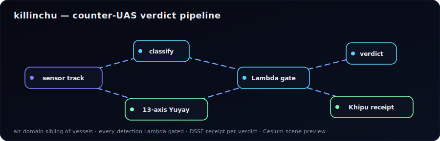
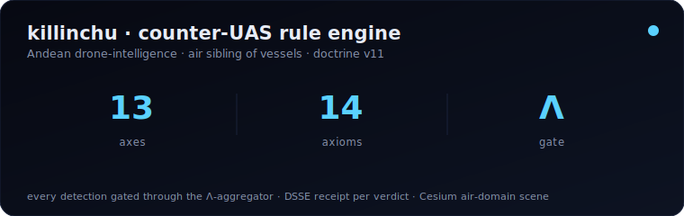
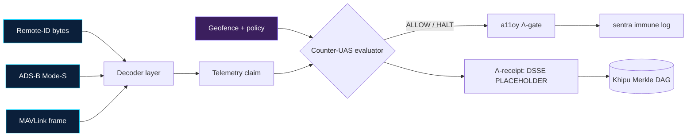

<div align="center">

# 🦅 killinchu

**Andean Drone Intelligence — a formally-anchored counter-UAS rule engine**

> *Killinchu* (Quechua) — the American kestrel, the smallest and sharpest-eyed falcon of the Andes. A fitting namesake for a rule engine that watches the sky.

[](https://www.apache.org/licenses/LICENSE-2.0)
[](https://github.com/szl-holdings/killinchu/actions/workflows/ci.yml)
[](https://github.com/szl-holdings/killinchu/actions/workflows/codeql.yml)
[](https://securityscorecards.dev/viewer/?uri=github.com/szl-holdings/killinchu)
[](https://github.com/szl-holdings/killinchu/security/dependabot)
[](https://slsa.dev/spec/v1.0/levels)
[](https://github.com/szl-holdings/.github/blob/main/DOCTRINE_V11.md)
[](https://orcid.org/0009-0001-0110-4173)
[](https://doi.org/10.5281/zenodo.19944926)

[Hugging Face Org](https://huggingface.co/SZLHOLDINGS) · [vessels (maritime sibling)](https://github.com/szl-holdings/vessels) · [GitHub Org](https://github.com/szl-holdings)

`telemetry.in → claim → policy → Λ-receipt.out`

</div>

---

<div align="center">

<!-- genius-hero (Doctrine v11) -->
<a href="https://szl-holdings.github.io/killinchu/"></a>

<sub><b><a href="https://szl-holdings.github.io/killinchu/">▶ Open the live air-domain scene (3D)</a></b> — telemetry → claim → policy → Λ-receipt, rendered as a live airspace.</sub>





</div>


## What killinchu is

killinchu is the **drone-intelligence flagship** of the SZL governance substrate — the air-domain
sibling of [`vessels`](https://github.com/szl-holdings/vessels) (maritime). It ingests open UAS
telemetry standards, treats every decoded field as an **unauthenticated claim**, scores claims
against geofence + policy, and emits an honest **Λ-receipt** onto the Khipu Merkle DAG.

It is the same substrate primitives as vessels — MMSI/IMO tracking → drone serial / ICAO-24 address,
dark-vessel detection → dark-drone (Remote-ID-off) detection, sanctions screening → permission
screening — extended with an air-domain decoder layer.

> **Honest scope.** killinchu parses **real** telemetry byte layouts (no mocks): malformed/short
> input returns honest errors, not fabricated fields. Receipt DSSE signatures are labelled
> `PLACEHOLDER` until Sigstore CI signing is wired (Doctrine v11). This repository is the canonical
> code home; counter-UAS policy gates compose with [`a11oy`](https://github.com/szl-holdings/a11oy)
> and the immune layer in [`sentra`](https://github.com/szl-holdings/sentra).

---

## Decoder substrate (open standards, real parsers)

| Standard | Spec | Library / parser | Status |
|---|---|---|---|
| **FAA Remote ID** | ASTM F3411-22a / 14 CFR Part 89 | byte parser (25-byte messages, type+version header) | implemented |
| **ADS-B Mode-S** | 1090ES, TSO-C166b (112-bit ES) | [`pyModeS`](https://github.com/junzis/pyModeS) | wired |
| **MAVLink** | v1 (`0xFE`) / v2 (`0xFD`) | [`pymavlink`](https://github.com/ArduPilot/pymavlink) | wired |
| **STANAG 4609 / MISB 0601** | NATO motion imagery + KLV | field reference catalog | catalog |

Telemetry is **unauthenticated broadcast** and therefore spoofable (see *Security of ADS-B and
Remote ID Systems*, Sensors 2026 — <https://pmc.ncbi.nlm.nih.gov/articles/PMC12846276/>).
killinchu scores decoded telemetry as **claims**, never as ground truth.

---

## Architecture



---

## Quick start

```bash
git clone https://github.com/szl-holdings/killinchu.git
cd killinchu
python3 -m venv .venv && source .venv/bin/activate
pip install -r requirements.txt        # pyModeS, pymavlink

# Decode an ADS-B Mode-S extended-squitter frame
python -m killinchu.decode adsb 8D4840D6202CC371C32CE0576098

# Evaluate telemetry against a geofence policy → ALLOW/HALT + Λ-receipt
python -m killinchu.evaluate --telemetry sample/rid_basic.json --policy policy/geofence.yaml
```

---

## Doctrine v11 — honest posture

- Formal anchor: **749** Lean 4 declarations · **14** unique axioms (15 raw, 1 duplicate) ·
  **163** tracked sorries (112 baseline + 51 Putnam) on
  [`lutar-lean@main`](https://github.com/szl-holdings/lutar-lean). Λ uniqueness is a
  **Conjecture**, not a closed theorem.
- **13-axis** canonical trust schema.
- **SLSA L2** (signed provenance via DSSE+Cosign; receipts now REAL-signed, verify with [cosign.pub](https://github.com/szl-holdings/.github/blob/main/cosign.pub)). NOT L3 (no hardened CI yet).
- Mythos: **Hatun-Willay**.

---

## Citation

See [`CITATION.cff`](./CITATION.cff). Concept DOI (always latest):
[10.5281/zenodo.19944926](https://doi.org/10.5281/zenodo.19944926).

## Contact

Founder: Stephen P. Lutar Jr. · [stephen@szlholdings.com](mailto:stephen@szlholdings.com) ·
ORCID [0009-0001-0110-4173](https://orcid.org/0009-0001-0110-4173) ·
Security: [security@szlholdings.com](mailto:security@szlholdings.com)

---

<sub>© 2026 SZL Holdings · Apache-2.0 · Doctrine v11 · Drone intelligence flagship (air sibling of vessels)</sub>
