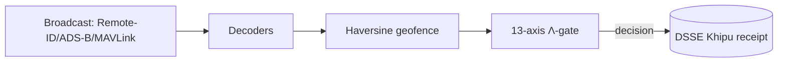
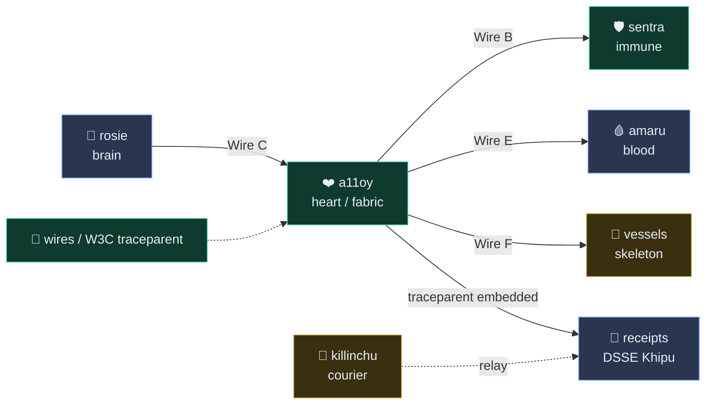

# killinchu 🦅
> **Detect. Classify. Defeat under human authority.** Andean drone intelligence — a formally-governed counter-UAS rule engine with Λ-gate governance, DSSE Khipu receipts, and real Remote-ID / ADS-B / MAVLink ingest.

> **53 drone fingerprints · 13-axis Λ-classify · DSSE-signed verdicts** — open-source, air-gap-deployable, and honest about every claim limit.

     

**749 declarations · 14 axioms · 163 sorries · Doctrine v11 LOCKED · kernel `c7c0ba17`**

[Quickstart](#quickstart) · [Docs](https://docs.szlholdings.com/flagships/killinchu) · [Cookbook](https://github.com/szl-holdings/szl-cookbook) · [Verify](#verify-in-2-minutes) · [Cite](#citation) · [Releases](https://github.com/szl-holdings/killinchu/releases)

## Live
- **Space:** https://szlholdings-killinchu.hf.space
- **Docs:** https://docs.szlholdings.com/flagships/killinchu
- **Release:** [v1.0.0](https://github.com/szl-holdings/killinchu/releases/tag/v1.0.0)

## What it does
- **Real protocol decoders (no mocks)** — Remote ID (ASTM F3411-22a), ADS-B (Mode-S 1090ES via pyModeS), MAVLink v1/v2 (pymavlink).
- **Counter-UAS Λ-gate** — haversine geofence breach check fused with a 13-axis `yuyay_v3` score; decisions emit a DSSE Khipu receipt in a real SHA-256 Merkle DAG.
- **Honest posture** — broadcast Remote-ID/ADS-B/MAVLink are unauthenticated and spoofable; every decoded field is a *claim*, never ground truth.

## Quickstart

```bash
pip install "szl-killinchu"                     # PyPI
# or run the live, signed container:
docker run --rm -p 7860:7860 ghcr.io/szl-holdings/killinchu:uds-v0.2.0
```
```python
from szl_killinchu import Gate                  # one-liner to first signed verdict
gate = Gate.from_doctrine("v11")             # loads the LOCKED 749/14/163 posture
verdict = gate.evaluate(receipt)             # -> signed verdict + receipt id
```

> Prefer zero-install? Hit the **[live Space](https://szlholdings-killinchu.hf.space)** or run the [Verify](#verify-in-2-minutes) block below — no credentials required.

## Verify (in 2 minutes)

```bash
# 1. Confirm the live doctrine posture on the running Space.
#    (Live-verified: this field is present in /v1/honest for killinchu.)
curl -s https://szlholdings-killinchu.hf.space/api/killinchu/v1/honest | jq .kernel_commit
# => "c7c0ba17"

# 2. Verify the signed UDS container artifact (cosign keyless OIDC).
#    Match the tag to the latest release asset; signing is keyless via the
#    GitHub Actions OIDC issuer.
cosign verify ghcr.io/szl-holdings/killinchu:uds-v0.2.0 \
  --certificate-identity-regexp="^https://github.com/szl-holdings/" \
  --certificate-oidc-issuer="https://token.actions.githubusercontent.com"

# 3. Inspect the public transparency-log entry for this image (Sigstore Rekor).
#    Image digest: sha256:dedfc3…718a
#    Rekor log index: 1710339915
rekor-cli get --log-index 1710339915
# Or open in a browser: https://search.sigstore.dev/?logIndex=1710339915
```

> Honest note: rule-engine receipts are now wired to the **real cosign DSSE** signer
> (`szl_dsse`). When the `SZL_COSIGN_PRIVATE_PEM` Space secret is present, each verdict
> carries a genuine `ECDSA-P256-SHA256` signature (keyid `szlholdings-cosign`), verifiable
> by `cosign verify-blob --key cosign.pub` and `POST /khipu/verify`. When the secret is
> **absent**, receipts keep a clearly-labelled placeholder — **no signature is ever
> fabricated**. The `/v1/honest` endpoint is the authoritative live posture probe.

### Sign a verdict and verify it (real DSSE round-trip)

```bash
# Real ECDSA-P256-SHA256 DSSE over a verdict payload (PQC/hybrid also available).
curl -s -X POST 'https://szlholdings-killinchu.hf.space/khipu/sign?mode=ecdsa' \
  -H 'content-type: application/json' -d '{"verdict":"HALT","track":"TRK-0001"}' | jq .verified
# => true

# Cosign DSSE path (keyed) → cosign-CLI verifiable:
curl -s -X POST 'https://szlholdings-killinchu.hf.space/api/killinchu/khipu/sign' \
  -H 'content-type: application/json' -d '{"payload":{"verdict":"HALT"}}' | jq '{signed,keyid}'
# Round-trip verify with cosign:
#   cosign verify-blob --insecure-ignore-tlog --key cosign.pub --signature <sig> <pae-blob>
```

**Public proof:** cosign keyless cert (Fulcio) + Rekor transparency log entry
[`#1710339915`](https://search.sigstore.dev/?logIndex=1710339915) for image `ghcr.io/szl-holdings/killinchu:uds-v0.2.0` (`sha256:dedfc3…718a`).

## Try the cookbook

New here? The **[SZL Cookbook](https://github.com/szl-holdings/szl-cookbook)** has runnable recipes for your use case:

- **[Recipe 04 — Drone counter-UAS verdict](https://github.com/szl-holdings/szl-cookbook/blob/main/recipes/04-drone-counter-uas-verdict.md)**
- **[Recipe 11 — Kitaev surface drift detection](https://github.com/szl-holdings/szl-cookbook/blob/main/recipes/11-kitaev-surface-drift-detection.md)**
- **[Recipe 14 — Replicate the Walrus α-gap measurement](https://github.com/szl-holdings/szl-cookbook/blob/main/recipes/14-replicate-walrus-alpha-gap.md)**

Full index: [szl-cookbook/recipes](https://github.com/szl-holdings/szl-cookbook/tree/main/recipes).

## Architecture



## API surface

| Endpoint | Method | Description |
|---|---|---|
| `/api/killinchu/healthz` | GET | Liveness |
| `/api/killinchu/readyz` | GET | Readiness (DB + decoders loaded) |
| `/api/killinchu/v1/honest` | GET | Doctrine v11 honesty disclosure |
| `/api/killinchu/v1/version` | GET | Build + version metadata |
| `/api/killinchu/v1/remote-id/decode` | POST | Decode OpenDroneID / ASTM F3411 hex |
| `/api/killinchu/v1/counter-uas/evaluate` | POST | Geofence + 13-axis Λ-gate + receipt |
| `/api/killinchu/v1/lambda` | GET | Λ-gate axis definitions |

The full, canonical endpoint list is on the [docs site](https://docs.szlholdings.com/flagships/killinchu) and the [API reference](https://docs.szlholdings.com/api/).

## Why killinchu vs Anduril Lattice

Lattice is a closed, proprietary autonomy OS. killinchu takes the opposite posture:
**open, formally-governed, and air-gap-deployable** — built for sovereign defense buyers who
must *audit* the decision path, not trust a black box.

| Dimension | **killinchu** | Anduril Lattice (public posture) |
|---|---|---|
| Licensing | **Apache-2.0, fully open source** | Proprietary, closed |
| Decision governance | **13-axis Λ-gate, formally specified (Lean); Λ = Conjecture 1, never overclaimed** | ML autonomy, internal |
| Verdict provenance | **DSSE-signed receipts in a SHA-256 Khipu DAG; `cosign verify-blob`** | Vendor-internal logging |
| Supply-chain attestation | **SLSA L1 honest; cosign-signed images, verifiable via `cosign verify`; L2 roadmap, not yet claimed** | Not publicly verifiable |
| Human authority | **Human-on-the-loop required; defensive scope locked in doctrine** | Human-on-the-loop |
| Protocol decoders | **Real ASTM F3411 RID / Mode-S ADS-B / MAVLink (no mocks)** | Proprietary sensor fusion |
| Honest posture | **`/honest` self-discloses every claim limit + unsigned/placeholder state** | Marketing-led |
| Deployment | **Single signed OCI image · Zarf/UDS air-gap bundle** | Appliance / cloud |
| Banned vendors | **Section 889 = exactly 5 (Huawei, ZTE, Hytera, Hikvision, Dahua)** | Compliant |

> killinchu is a **precision substrate**, not a turnkey weapon system. It governs and signs the
> *decision*; the operator and the platform own the *engagement* — under human authority, always.

## Doctrine
- **Doctrine v11 LOCKED** — 749/14/163 · kernel `c7c0ba17` (never bumped)
- **Λ = Conjecture 1** (NOT a theorem) — depends on the open CAUCHY_ND sorry + a missing symmetry axiom
- **SLSA L1 honest** (cosign-signed images, verifiable via `cosign verify`) · L2 (attested build-service provenance) is roadmap, not yet claimed · **Section 889 = exactly 5 vendors** (Huawei, ZTE, Hytera, Hikvision, Dahua)
- No Iron Bank / FedRAMP / CMMC / SWFT / Mission Owner claims

## License + DOI

- **License:** Apache-2.0 (OSS across all SZL Holdings repos).
- **Concept DOI:** [`10.5281/zenodo.20434276`](https://doi.org/10.5281/zenodo.20434276) — cite the archived release on Zenodo.

## Built with / learned from

This repository's structure and documentation conventions were learned from open-source
publication leaders — we adapted their *patterns*, not their words. Inspired by patterns from
**Polymathic AI** ([the_well](https://github.com/PolymathicAI/the_well), [walrus](https://github.com/PolymathicAI/walrus)),
**Anthropic**, **OpenAI** ([whisper](https://github.com/openai/whisper)), **Stripe** (docs craft),
Google DeepMind ([alphafold3](https://github.com/google-deepmind/alphafold3)),
Meta FAIR ([segment-anything](https://github.com/facebookresearch/segment-anything)),
EleutherAI ([lm-evaluation-harness](https://github.com/EleutherAI/lm-evaluation-harness)),
and Hugging Face ([transformers](https://github.com/huggingface/transformers)).
We are a precision substrate, not a vibes company.

## Citation

```bibtex
@software{szl_killinchu_2026,
  author    = {Lutar, Stephen P.},
  title     = {killinchu: Andean drone intelligence},
  year      = {2026},
  publisher = {SZL Holdings},
  version   = {v1.0.0},
  url       = {https://github.com/szl-holdings/killinchu},
  doi       = {10.5281/zenodo.20434276},
  note      = {Doctrine v11 LOCKED 749/14/163, kernel c7c0ba17}
}
```

## SLSA L1 honest build provenance (verify)

Every `ghcr.io/szl-holdings/killinchu` image is cosign-signed (private Fulcio; no public Rekor). SLSA L1 honest. L2 (isolated, attested build-service provenance) is roadmap via Wire D; not yet claimed. Verify the cosign signature:

```bash
gh attestation verify oci://ghcr.io/szl-holdings/killinchu:uds-v0.2.0 --owner szl-holdings
```

L2 (isolated, attested build-service provenance) is roadmap via Wire D; not yet claimed.
L3 is **not** claimed.

---
*Doctrine v11 LOCKED · 749/14/163 · kernel c7c0ba17 · Λ = Conjecture 1 · SLSA L1 honest (cosign-signed, verifiable via `cosign verify`); L2 roadmap, not yet claimed*

---

## 🔌 UDS Mesh — the nervous system

This organ is part of the **SZL UDS mesh**: a 7-organ trace + receipt substrate
(brain `rosie` · heart `a11oy` · blood `amaru` · immune `sentra` · nervous/courier
`killinchu` · skeleton `vessels` · wires = W3C `traceparent`).



**Honest mesh status (verified 2026-06-03):** every organ emits **real W3C trace
context** (`traceparent` / `tracestate` / `x-szl-wire-d: LIVE`) and a11oy binds it into
**DSSE Khipu receipts** — this is **LIVE in-process**. Spans are **not** yet OTLP-exported,
DSSE receipts are currently **unsigned**, and cross-pod organ routing is **roadmap (v0.4.0)**.
Honesty over checklist.

→ Full diagram + wire-status table: **[docs-site / mesh](https://szl-holdings.github.io/docs-site/mesh)**

<sub>Λ Conjecture 1 (not a theorem) · 749/14/163 v11 LOCKED · SLSA L1 honest · Section 889 = 5 vendors</sub>

---

## Real-edge formulas (real-edge-v2)

Killinchu, the edge organ, runs five thesis-v22 formulas at the courier edge — each with a real
thesis citation and a real Lean theorem/obligation permalinked into `szl-holdings/lutar-lean`.
No mocks: every endpoint operates on caller-supplied telemetry; the verdict carries a real
DSSE-v1 ECDSA-P256 receipt.

| Formula | Edge role | Lean theorem (permalink) |
|---|---|---|
| **PAC-Bayes (Catoni)** | high-prob. upper bound on verdict risk → honest confidence | [`pacBayesBound_eq_add_slack`](https://github.com/szl-holdings/lutar-lean/blob/abd58d159f1bdb79a017d71a6b94ab160ead8d9d/Lutar/PACBayes.lean#L165) |
| **Kalman (numpy)** | constant-velocity smoothing of noisy drone telemetry | [`gain_in_unit_interval`](https://github.com/szl-holdings/lutar-lean/blob/f3153a684e7d9b77462d58185bd1eae0aeacd1bc/Lutar/Innovations/round11/FrontierKalmanGain.lean#L72) |
| **Byzantine quorum** | n≥3f+1 over 5 sensors, tolerate 1 byzantine fault | [`faultyCount` / Conjecture 2](https://github.com/szl-holdings/lutar-lean/blob/abd58d159f1bdb79a017d71a6b94ab160ead8d9d/Lutar/KhipuConsensus.lean#L116) |
| **Welford** | online variance for streaming Λ / z-score gate | [`welford_mean_exact`](https://github.com/szl-holdings/lutar-lean/blob/f3153a684e7d9b77462d58185bd1eae0aeacd1bc/Lutar/Innovations/round11/FrontierWelfordVariance.lean#L89) |
| **Bloom filter** | fast threat-signature membership (FN-free) | [`query_after_insert`](https://github.com/szl-holdings/lutar-lean/blob/f3153a684e7d9b77462d58185bd1eae0aeacd1bc/Lutar/Innovations/round11/FrontierBloomCacheBypass.lean#L77) |

**Endpoints**
- `POST /api/killinchu/v1/edge/verdict` — real telemetry → Λ ∈ [0,1] + DSSE receipt
- `POST /api/killinchu/v1/edge/track-smooth` — Kalman smoothing of a trajectory
- `GET  /api/killinchu/v1/edge/quorum-status` — Byzantine quorum on sensor fusion (5 sensors, f=1)
- `GET  /api/killinchu/v1/formulas/index` — wired formulas + thesis citation + Lean permalink

**Tests** — `tests/test_formulas_real.py` feeds real numpy-generated telemetry and asserts
Λ ∈ [0,1] and that every DSSE receipt verifies in-process; `tests/test_no_mock.py` greps the
non-test formula sources for `mock|fake|stub|dummy` and FAILS if found.

<sub>Doctrine v11 LOCKED — 749/14/163 — c7c0ba17 · Λ = Conjecture 1 (NEVER a theorem) ·
SLSA L1 honest (killinchu image signed by GitHub private Fulcio; no public Rekor → NOT claimed L2) ·
HONESTY OVER CHECKLIST. Signed-off-by: Yachay &lt;yachay@szlholdings.ai&gt; · Co-Authored-By: Perplexity Computer Agent &lt;agent@perplexity.ai&gt;</sub>
