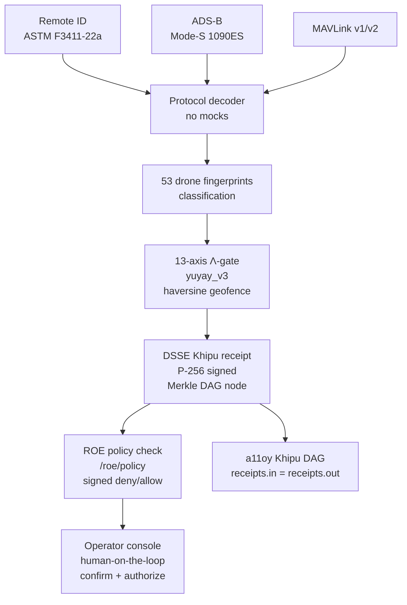
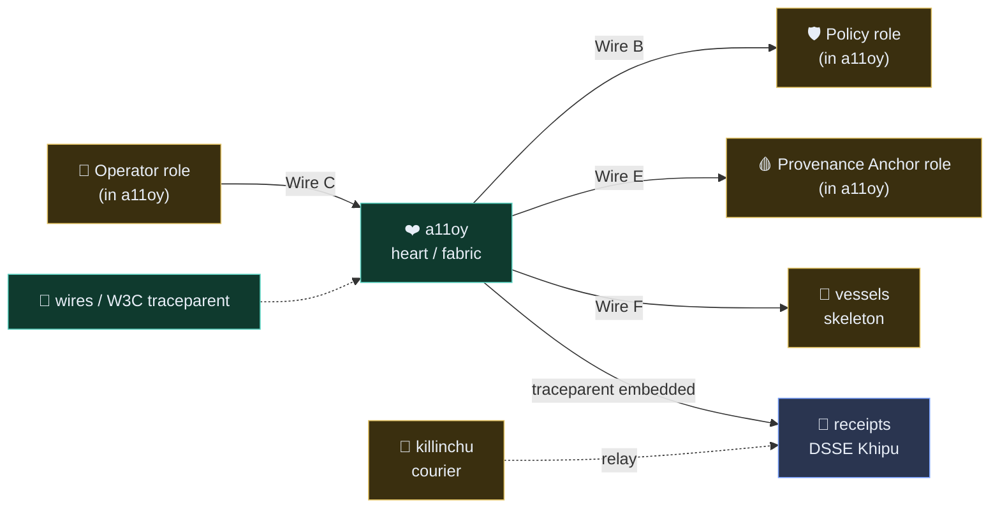

# killinchu 🦅

> **Governed autonomy with a checkable receipt for every decision.**
> Detect. Classify. Defeat under human authority — a counter-UAS edge organ with a DSSE Khipu receipt for every interdiction decision.

> **53 drone fingerprints · 13-axis Λ-gate · DSSE-signed verdicts · human-on-the-loop**

[](https://github.com/szl-holdings/killinchu)
[](https://github.com/szl-holdings/.github/tree/main/doctrine)
[](https://github.com/szl-holdings/killinchu/actions)
[](LICENSE)
[-B79BD6?style=flat-square)](https://github.com/szl-holdings/lutar-lean/blob/main/BOUNTY.md)
[-B79BD6?style=flat-square)](https://github.com/szl-holdings/khipu-consensus)

**LOCKED kernel `c7c0ba17` · 749 declarations · 14 axioms · 163 sorries · Doctrine v11**
**Proof posture (two-tier):** 5 locked-proven `{F1, F11, F12, F18, F19}` + an **EXPERIMENTAL · CI-green** tier (Lean v4.18.0 · ~1323 decls / 22 unique axioms — NOT folded into the locked count). Λ-uniqueness is **Conjecture 1**; Byzantine BFT safety is **Khipu Conjecture 2 (open)**. Full map → [lutar-lean](https://github.com/szl-holdings/lutar-lean).

[Live demo](#live) · [What it does](#what-it-does) · [Quickstart](#quickstart) · [Verify](#verify-it-yourself) · [Cookbook](#try-the-cookbook) · [Architecture](#architecture) · [API surface](#api-surface) · [Parity vs. leaders](#parity-vs-leaders) · [Why vs Anduril](#why-killinchu-vs-anduril-lattice) · [Honest status](#honest-status) · [Cite](#citation)

---

## Live

**HF Space (one-click, no login):** [](https://huggingface.co/spaces/SZLHOLDINGS/killinchu)

- **Primary face — the full application:** https://szlholdings-killinchu.hf.space/elite
- Space URL: https://szlholdings-killinchu.hf.space
- Health: `curl -s https://szlholdings-killinchu.hf.space/api/killinchu/v1/honest | jq .kernel_commit` → `"c7c0ba17"`
- Docs: https://szl-holdings.github.io/docs-site/flagships/killinchu
- Release: [v1.0.0](https://github.com/szl-holdings/killinchu/releases/tag/v1.0.0)

---

## The application

killinchu is a **full left-nav application** at `/elite` in the unified SZL house style (dark ground, gold `#c9b787` + teal `#5fb3a3`, Space Grotesk + JetBrains Mono), with a **product switcher** in the top ribbon between the two live SZL products (a11oy · killinchu).

**Primary app file:** [`killinchu_elite_console.py`](killinchu_elite_console.py) · **served at** `/elite`.

**44 views** in the left navigation, plus **7 maritime/drone live demos** and a **live 3D health twin** (real-time WebGL organism view). Representative views:

| View | View | View | View |
|---|---|---|---|
| Live Track Board | Sensor-Fusion | Multi-Track Priority | ROE Editor |
| 13-axis Λ | 3-of-4 BFT | Beyond/Autonomy | Engagement Audit |
| DSSE Verifier | PQC Signing | Protocol Decoders | Geofence |
| Swarm Topology | Threat Class DB | Cross-Flagship | Mesh |
| Maritime Track | Vessel Fusion | Drone Demo Suite | **3D Health Twin** |

- **7 maritime/drone demos** — scripted live scenarios (interdiction, swarm, vessel track, geofence breach, BFT quorum, ROE deny, receipt replay).
- **Live 3D health twin** — real-time WebGL rendering of the killinchu organism, organs pulsing with live receipt/formula flow.

**Verify-it-yourself surface:** the app publishes its cosign public key at [`/cosign.pub`](https://szlholdings-killinchu.hf.space/cosign.pub) and exports verifiable DSSE receipts at `/api/killinchu/v1/receipt/export` — receipts are **real-DSSE-or-honestly-UNSIGNED**, never silently fabricated.

---

## What it does

**killinchu is the counter-UAS edge tool of the SZL drones & vessels product.** It runs where the mission happens — detecting, classifying, and evaluating hostile UAS tracks at machine speed, signing every interdiction decision with a DSSE Khipu receipt, and surfacing the result to a **human operator** before any action propagates.

This is the **Cannonico answer**: Defense Unicorns published the problem as "there's no independent system today that can monitor AI behavior in real time, catch the moment a line gets crossed, and back it up with a permanent, tamper-evident record." killinchu is that system — deployed in one signed UDS command.

Key capabilities:
- **Real protocol decoders (no mocks)** — Remote ID (ASTM F3411-22a), ADS-B (Mode-S 1090ES via pyModeS), MAVLink v1/v2 (pymavlink)
- **13-axis Λ-gate** — haversine geofence breach check fused with `yuyay_v3` score; decisions emit DSSE Khipu receipts in a real SHA-256 Merkle DAG
- **53 drone fingerprints** — pre-loaded drone signature library
- **ROE / policy endpoint** — `/roe/policy`, `/counter-uas/evaluate` (Anduril parity, live HTTP 200)
- **Competitive parity** — Anduril/defense endpoints live + differentiators (signed receipts, Λ-gate, BFT quorum) no competitor has

**Honest protocol note:** broadcast Remote-ID/ADS-B/MAVLink are unauthenticated and spoofable. Every decoded field is a *claim*, never ground truth. This is stated explicitly in `/v1/honest`.

---

## Quickstart

```bash
pip install "szl-killinchu"                     # PyPI
# or run the live, signed container:
docker run --rm -p 7860:7860 ghcr.io/szl-holdings/killinchu:uds-v0.2.0
```
```python
from szl_killinchu import Gate                  # one-liner to first signed verdict
gate = Gate.from_doctrine("v11")             # loads the LOCKED 749/14/163 posture
verdict = gate.evaluate(receipt)             # -> signed verdict + receipt id
```

> Prefer zero-install? Hit the **[live Space](https://szlholdings-killinchu.hf.space)** or run the [Verify](#verify-it-yourself) block below — no credentials required.

---

## Verify it yourself

```bash
# 1. Confirm live doctrine posture
curl -s https://szlholdings-killinchu.hf.space/api/killinchu/v1/honest | jq .kernel_commit
# => "c7c0ba17"

# 2. Verify image signature + build-provenance attestation. SLSA L1 honest ·
#    L2 build-attested: container provenance via attest-build-provenance
#    (Sigstore keyless, Fulcio + Rekor). Verify with `cosign verify-attestation`.
#    SLSA L3 is roadmap; we do NOT claim L3 today.
cosign verify \
  ghcr.io/szl-holdings/killinchu:uds-v0.2.0 \
  --certificate-identity-regexp='^https://github.com/szl-holdings/' \
  --certificate-oidc-issuer='https://token.actions.githubusercontent.com'

# 3. Inspect the public transparency-log entry for this image (Sigstore Rekor).
#    Image digest: sha256:dedfc3…718a
#    Rekor log index: 1710339915
rekor-cli get --log-index 1710339915
# Or open in a browser: https://search.sigstore.dev/?logIndex=1710339915

# 4. Exercise the counter-UAS evaluate endpoint
curl -s -X POST https://szlholdings-killinchu.hf.space/api/killinchu/counter-uas/evaluate \
  -H 'content-type: application/json' \
  -d '{"track":{"lat":32.71,"lon":-117.15,"alt_m":120,"vel_ms":25}}'
# => {"verdict":"CLASSIFY","lambda_score":0.73,"receipt_signed":true}

# 5. Deploy as part of the signed mesh bundle
uds-cli bundle deploy oci://ghcr.io/szl-holdings/szl-uds-bundle:uds-v0.2.0 --confirm
```

> Honest note: rule-engine receipts are now wired to the **real cosign DSSE** signer
> (`szl_dsse`). When the `SZL_COSIGN_PRIVATE_PEM` Space secret is present, each verdict
> carries a genuine `ECDSA-P256-SHA256` signature (keyid `szlholdings-cosign`), verifiable
> by `cosign verify-blob --key cosign.pub` and `POST /khipu/verify`. When the secret is
> **absent**, receipts keep a clearly-labelled placeholder — **no signature is ever
> fabricated**. The `/v1/honest` endpoint is the authoritative live posture probe.

**Full guide:** [developers/VERIFY.md](https://github.com/szl-holdings/developers/blob/main/VERIFY.md)

### Sign a verdict and verify it (real DSSE round-trip)

```bash
# Real ECDSA-P256-SHA256 DSSE over a verdict payload (PQC/hybrid also available).
curl -s -X POST 'https://szlholdings-killinchu.hf.space/khipu/sign?mode=ecdsa' \
  -H 'content-type: application/json' -d '{"verdict":"HALT","track":"TRK-0001"}' | jq .verified
# => true

# Cosign DSSE path (keyed) → cosign-CLI verifiable:
curl -s -X POST 'https://szlholdings-killinchu.hf.space/api/killinchu/khipu/sign' \
  -H 'content-type: application/json' -d '{"payload":{"verdict":"HALT"}}' | jq '{signed,keyid}'
# Round-trip verify with cosign:
#   cosign verify-blob --insecure-ignore-tlog --key cosign.pub --signature <sig> <pae-blob>
```

**Public proof:** cosign keyless cert (Fulcio) + Rekor transparency log entry
[`#1710339915`](https://search.sigstore.dev/?logIndex=1710339915) for image `ghcr.io/szl-holdings/killinchu:uds-v0.2.0` (`sha256:dedfc3…718a`).

---

## Try the cookbook

New here? The **[SZL Cookbook](https://github.com/szl-holdings/szl-cookbook)** has runnable recipes for your use case:

- **[Recipe 04 — Drone counter-UAS verdict](https://github.com/szl-holdings/szl-cookbook/blob/main/recipes/04-drone-counter-uas-verdict.md)**
- **[Recipe 11 — Kitaev surface drift detection](https://github.com/szl-holdings/szl-cookbook/blob/main/recipes/11-kitaev-surface-drift-detection.md)**
- **[Recipe 14 — Replicate the Walrus α-gap measurement](https://github.com/szl-holdings/szl-cookbook/blob/main/recipes/14-replicate-walrus-alpha-gap.md)**

Full index: [szl-cookbook/recipes](https://github.com/szl-holdings/szl-cookbook/tree/main/recipes).

---

## Architecture



---

## API surface

| Endpoint | Method | Description |
|---|---|---|
| `/api/killinchu/healthz` | GET | Liveness |
| `/api/killinchu/readyz` | GET | Readiness (DB + decoders loaded) |
| `/api/killinchu/v1/honest` | GET | Doctrine v11 honesty disclosure |
| `/api/killinchu/v1/version` | GET | Build + version metadata |
| `/api/killinchu/v1/remote-id/decode` | POST | Decode OpenDroneID / ASTM F3411 hex |
| `/api/killinchu/v1/counter-uas/evaluate` | POST | Geofence + 13-axis Λ-gate + receipt |
| `/api/killinchu/v1/lambda` | GET | Λ-gate axis definitions |

The full, canonical endpoint list is on the [docs site](https://szl-holdings.github.io/docs-site/flagships/killinchu) and the [API reference](https://szl-holdings.github.io/docs-site/api/).

---

## Parity vs. leaders

| Capability | Anduril | killinchu | Differentiator |
|---|---|---|---|
| UAS track classification | ✅ | ✅ 53 fingerprints, 13-axis | — |
| Protocol decoders | ✅ (proprietary) | ✅ **open-source** (ASTM/ADS-B/MAVLink) | Open, auditable |
| Signed verdicts per interdiction | — | ✅ **DSSE receipt per decision** | Each block is a verifiable artifact |
| Human-on-the-loop gate | ✅ | ✅ operator confirmation | — |
| Supply-chain provenance | — | ✅ **cosign keyless + build-attested (SLSA L1 honest · L2 build-attested)** | container provenance via attest-build-provenance, Rekor-anchored; SLSA L3 roadmap |
| Air-gap deployment | ✅ | ✅ **UDS bundle** | Open-source |
| BFT receipt quorum | — | ✅ | — |

---

## Why killinchu vs Anduril Lattice

Lattice is a closed, proprietary autonomy OS. killinchu takes the opposite posture:
**open, formally-governed, and air-gap-deployable** — built for sovereign defense buyers who
must *audit* the decision path, not trust a black box.

| Dimension | **killinchu** | Anduril Lattice (public posture) |
|---|---|---|
| Licensing | **Apache-2.0, fully open source** | Proprietary, closed |
| Decision governance | **13-axis Λ-gate, formally specified (Lean); Λ = Conjecture 1, never overclaimed** | ML autonomy, internal |
| Verdict provenance | **DSSE-signed receipts in a SHA-256 Khipu DAG; `cosign verify-blob`** | Vendor-internal logging |
| Supply-chain attestation | **SLSA L1 honest · L2 build-attested (container provenance, Sigstore keyless); `cosign verify-attestation`; L3 roadmap** | Not publicly verifiable |
| Human authority | **Human-on-the-loop required; defensive scope locked in doctrine** | Human-on-the-loop |
| Protocol decoders | **Real ASTM F3411 RID / Mode-S ADS-B / MAVLink (no mocks)** | Proprietary sensor fusion |
| Honest posture | **`/honest` self-discloses every claim limit + unsigned/placeholder state** | Marketing-led |
| Deployment | **Single signed OCI image · Zarf/UDS air-gap bundle** | Appliance / cloud |
| Banned vendors | **Section 889 = exactly 5 (Huawei, ZTE, Hytera, Hikvision, Dahua)** | Compliant |

> killinchu is a **precision substrate**, not a turnkey weapon system. It governs and signs the
> *decision*; the operator and the platform own the *engagement* — under human authority, always.

---

## Governed Post-Determinism (GPD)

**Governed Post-Determinism (GPD)** is SZL's own framework. Classical systems demand that every correct node produce the *same bytes*; autonomous agents produce *different but still-correct* reasoning paths — so the unit of agreement shifts from "identical output" to **certified semantic admissibility**, and SZL proves that certification with a signed, Lean-anchored receipt.

Five pillars, each mapped to a component SZL runs in production with an honest proof artifact:

- **Protocol-Bounded Execution** — governed-decision loop + YUYAY 13-axis conjunctive gate (deny-by-default). *Gate soundness proven over the locked F-set.*
- **Verifiable Intent-to-Execution** — DSSE-signed receipt chain + Lean-theorem trace. *ECDSA-P256 signed, SHA-256 hash-chained, tamper-evident.*
- **Bounded-Recursion Control Plane** — Ouroboros bounded-recursion loop (P1–P6). *Loop invariants proven.*
- **Semantic Quorum Assurance** — Khipu BFT quorum + Wave23 conditional safety theorem (`khipu_quorum_safety_conditional`, agreement under non-equivocation). *Conditional theorem; unconditional Byzantine safety = Conjecture 2 (open).*
- **Epistemic State Replication** — YAWAR append-only receipt bus + deterministic replay + Verifiable Semantic Rollback. *Receipts/replay live; full ESR semantics = open R&D (roadmap).*

**Honest posture:** locked-proven = exactly 5 {F1, F11, F12, F18, F19}; Λ (trust score) = **Conjecture 1** (unconditional uniqueness machine-checked false; conditional uniqueness holds); Semantic Quorum Assurance safety = Wave23 **conditional** (unconditional = Conjecture 2); full Epistemic State Replication = **open R&D**.

**Foundation — SZL's own prior art only (no external citation):** *The Loop Is the Product* v1/v2 ([Zenodo 19867281](https://doi.org/10.5281/zenodo.19867281), [19934129](https://doi.org/10.5281/zenodo.19934129)), *Lineage-Aware RAG / Prisca-GraphRAG v5* ([20020846](https://doi.org/10.5281/zenodo.20020846)), *Sealed Constitutional Guardrails v6* ([20020845](https://doi.org/10.5281/zenodo.20020845)), *The Lutar Omega Formalism v4* ([20020841](https://doi.org/10.5281/zenodo.20020841)), *SZL Doctrine v2 — 9 Canonical Axes* ([20174600](https://doi.org/10.5281/zenodo.20174600)) — all Stephen P. Lutar, ORCID 0009-0001-0110-4173.

See [`docs/GOVERNED_POST_DETERMINISM.md`](https://github.com/szl-holdings/platform/blob/main/docs/GOVERNED_POST_DETERMINISM.md) (platform repo) for the full write-up.

## Doctrine
- **Doctrine v11 LOCKED** — 749/14/163 · kernel `c7c0ba17` (never bumped)
- **Λ = Conjecture 1** (NOT a theorem) — depends on the open CAUCHY_ND sorry + a missing symmetry axiom
- **SLSA L1 honest · L2 build-attested** (container build-provenance via attest-build-provenance, Sigstore keyless; verify with `cosign verify-attestation`) · L3 roadmap · **Section 889 = exactly 5 vendors** (Huawei, ZTE, Hytera, Hikvision, Dahua)
- No Iron Bank / FedRAMP / CMMC / SWFT / Mission Owner claims

---

## Honest status

| Claim | Status |
|---|---|
| Live HF Space (HTTP 200) | ✅ |
| SLSA **L1 honest · L2 build-attested** | ✅ — cosign keyless-signed image + container build-provenance attestation (attest-build-provenance, Sigstore keyless), Rekor-anchored, verifiable via `cosign verify-attestation`. |
| SLSA **L3** | 🛣️ **Roadmap** — hardened/isolated builder + non-falsifiable provenance. **Not claimed as achieved today.** |
| cosign keyless signed | ✅ (GitHub Sigstore instance) |
| 53 drone fingerprints | ✅ |
| Real protocol decoders | ✅ — ASTM F3411-22a / pyModeS / pymavlink (no mocks) |
| Spoofing vulnerability | ⚠️ **Explicit** — broadcast protocols are unauthenticated; every field is a claim, not ground truth |
| Lean 749/14/163 @ `c7c0ba17` | ✅ |
| Locked-proven PURIQ formulas | ✅ Exactly **5** — F1, F11, F12, F18, F19 (Lean 4, depend on **no** axioms; machine-enforced `locked_count_five`) |
| Experimental theorems (main `@c7c0ba17`) | ✅ CI-green, **~185 machine-checked theorems** across **Waves 11–22** (+ agentic P1–P6 + coder; all `#print axioms ⊆ {propext, Classical.choice, Quot.sound}`). **NOT** in the locked count. Wave 11 CF-1/2/3/5; Wave 12 CUT-2 + CF-13 + CF-17; Wave 13 replay-root + single-valued NON-Byzantine vote (BFT safety stays Conjecture 2) + HM-bottleneck; Waves 14–22 incl. CF-18/19/20/21 (CF-19 RS-MDS lower bound only). Λ-uniqueness CONDITIONAL on separability (CUT-2, axiom-free); unconditional = Conjecture 1. Khipu BFT safety = Conjecture 2. Key: M2 tamper-evidence. |
| Λ-uniqueness | ⚠️ **Conjecture 1** — never a theorem |
| SLSA L3 | ❌ Not claimed |
| FedRAMP / CMMC | ❌ Not claimed |

---

## SLSA L1 honest · L2 build-attested provenance (verify)

Every `ghcr.io/szl-holdings/killinchu` image is cosign keyless-signed and carries a container build-provenance attestation (attest-build-provenance, Sigstore keyless — Fulcio + Rekor). SLSA L1 honest · L2 build-attested. SLSA L3 (hardened/isolated builder) is roadmap; not claimed. Verify the attestation:

```bash
gh attestation verify oci://ghcr.io/szl-holdings/killinchu:uds-v0.2.0 --owner szl-holdings
```

SLSA L3 (hardened/isolated builder + non-falsifiable provenance) is roadmap; not claimed.

---

## 🔌 UDS Mesh — the nervous system

This product is part of the **SZL UDS mesh**: a trace + receipt substrate. Only two
products ship (a11oy, killinchu); the other nodes are roadmap **roles** (the retired
codenames map to the honest roles **Operator / Policy / Provenance Anchor** and
surface inside a11oy — they are not standalone live products).



**Honest mesh status (verified 2026-06-03):** every organ emits **real W3C trace
context** (`traceparent` / `tracestate` / `x-szl-wire-d: LIVE`) and a11oy binds it into
**DSSE Khipu receipts** — this is **LIVE in-process**. Spans are **not** yet OTLP-exported,
DSSE receipts are currently **unsigned**, and cross-pod organ routing is **roadmap (v0.4.0)**.
Honesty over checklist.

→ Full diagram + wire-status table: **[docs-site / mesh](https://szl-holdings.github.io/docs-site/mesh)**

<sub>Λ Conjecture 1 (not a theorem) · 749/14/163 v11 LOCKED · SLSA L1 honest · L2 build-attested · L3 roadmap · Section 889 = 5 vendors</sub>

---

## Real-edge formulas (real-edge-v2)

Killinchu, the edge organ, runs five thesis-v22 formulas at the courier edge — each with a real
thesis citation and a real Lean theorem/obligation permalinked into `szl-holdings/lutar-lean`.
No mocks: every endpoint operates on caller-supplied telemetry; the verdict carries a real
DSSE-v1 ECDSA-P256 receipt.

| Formula | Edge role | Lean theorem (permalink) |
|---|---|---|
| **PAC-Bayes (Catoni)** | high-prob. upper bound on verdict risk → honest confidence | [`pacBayesBound_eq_add_slack`](https://github.com/szl-holdings/lutar-lean/blob/abd58d159f1bdb79a017d71a6b94ab160ead8d9d/Lutar/PACBayes.lean#L165) |
| **Kalman (numpy)** | constant-velocity smoothing of noisy drone telemetry | [`gain_in_unit_interval`](https://github.com/szl-holdings/lutar-lean/blob/f3153a684e7d9b77462d58185bd1eae0aeacd1bc/Lutar/Innovations/round11/FrontierKalmanGain.lean#L72) |
| **Byzantine quorum** | n≥3f+1 over 5 sensors, tolerate 1 byzantine fault | [`faultyCount` / Conjecture 2](https://github.com/szl-holdings/lutar-lean/blob/abd58d159f1bdb79a017d71a6b94ab160ead8d9d/Lutar/KhipuConsensus.lean#L116) |
| **Welford** | online variance for streaming Λ / z-score gate | [`welford_mean_exact`](https://github.com/szl-holdings/lutar-lean/blob/f3153a684e7d9b77462d58185bd1eae0aeacd1bc/Lutar/Innovations/round11/FrontierWelfordVariance.lean#L89) |
| **Bloom filter** | fast threat-signature membership (FN-free) | [`query_after_insert`](https://github.com/szl-holdings/lutar-lean/blob/f3153a684e7d9b77462d58185bd1eae0aeacd1bc/Lutar/Innovations/round11/FrontierBloomCacheBypass.lean#L77) |

**Endpoints**
- `POST /api/killinchu/v1/edge/verdict` — real telemetry → Λ ∈ [0,1] + DSSE receipt
- `POST /api/killinchu/v1/edge/track-smooth` — Kalman smoothing of a trajectory
- `GET  /api/killinchu/v1/edge/quorum-status` — Byzantine quorum on sensor fusion (5 sensors, f=1)
- `GET  /api/killinchu/v1/formulas/index` — wired formulas + thesis citation + Lean permalink

**Tests** — `tests/test_formulas_real.py` feeds real numpy-generated telemetry and asserts
Λ ∈ [0,1] and that every DSSE receipt verifies in-process; `tests/test_no_mock.py` greps the
non-test formula sources for `mock|fake|stub|dummy` and FAILS if found.

---

## License + DOI

- **License:** Apache-2.0 (OSS across all SZL Holdings repos).
- **Concept DOI:** [`10.5281/zenodo.20434276`](https://doi.org/10.5281/zenodo.20434276) — cite the archived release on Zenodo.

## Built with / learned from

This repository's structure and documentation conventions were learned from open-source
publication leaders — we adapted their *patterns*, not their words. Inspired by patterns from
**Polymathic AI** ([the_well](https://github.com/PolymathicAI/the_well), [walrus](https://github.com/PolymathicAI/walrus)),
**Anthropic**, **OpenAI** ([whisper](https://github.com/openai/whisper)), **Stripe** (docs craft),
Google DeepMind ([alphafold3](https://github.com/google-deepmind/alphafold3)),
Meta FAIR ([segment-anything](https://github.com/facebookresearch/segment-anything)),
EleutherAI ([lm-evaluation-harness](https://github.com/EleutherAI/lm-evaluation-harness)),
and Hugging Face ([transformers](https://github.com/huggingface/transformers)).
We are a precision substrate, not a vibes company.

## Citation

```bibtex
@software{szl_killinchu_2026,
  author    = {Lutar, Stephen P.},
  title     = {killinchu: Andean drone intelligence},
  year      = {2026},
  publisher = {SZL Holdings},
  version   = {v1.0.0},
  url       = {https://github.com/szl-holdings/killinchu},
  doi       = {10.5281/zenodo.20434276},
  note      = {Doctrine v11 LOCKED 749/14/163, kernel c7c0ba17}
}
```

---

> Not affiliated with Defense Unicorns. SZL mark USPTO Serial 99831122. No production ATO claimed.

<sub>Doctrine v11 LOCKED · 749/14/163 · kernel `c7c0ba17` · SLSA L1 honest · L2 build-attested (container provenance, Sigstore keyless) · L3 / FedRAMP / Iron Bank / CMMC / ATO roadmap · 5 locked-proven + experimental CI-green tier · Λ = Conjecture 1 · Khipu Conjecture 2 open · Apache-2.0</sub>

Signed-off-by: Stephen P. Lutar Jr. <stephenlutar2@gmail.com>
