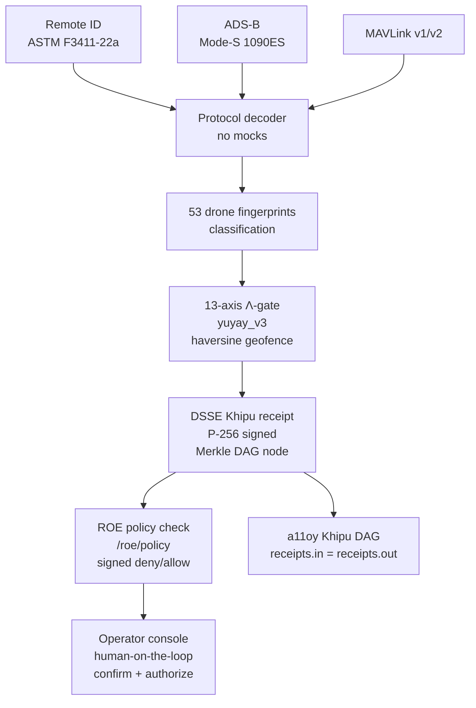

# killinchu 🦅

> **Detect. Classify. Defeat under human authority. Counter-UAS edge organ with a DSSE Khipu receipt for every interdiction decision.**

> **53 drone fingerprints · 13-axis Λ-gate · DSSE-signed verdicts · human-on-the-loop**

[](https://github.com/szl-holdings/killinchu)
[](https://github.com/szl-holdings/.github/tree/main/doctrine)
[](https://github.com/szl-holdings/killinchu/actions)
[](LICENSE)

**LOCKED kernel `c7c0ba17` · 749 declarations · 14 axioms · 163 sorries · Doctrine v11**
**Proof posture (two-tier):** 5 locked-proven `{F1, F11, F12, F18, F19}` + an **EXPERIMENTAL · CI-green** tier (Lean v4.18.0 · ~1323 decls / 22 unique axioms — NOT folded into the locked count). Λ-uniqueness is **Conjecture 1**; Byzantine BFT safety is **Khipu Conjecture 2 (open)**. Full map → [lutar-lean](https://github.com/szl-holdings/lutar-lean).

[Live demo](#live) · [What it does](#what-it-does) · [Verify](#verify-it-yourself) · [Architecture](#architecture) · [Parity vs. leaders](#parity-vs-leaders) · [Honest status](#honest-status)

---

## Live

**HF Space (one-click, no login):** [](https://huggingface.co/spaces/SZLHOLDINGS/killinchu)

- **Primary face — the full application:** https://szlholdings-killinchu.hf.space/elite
- Space URL: https://szlholdings-killinchu.hf.space
- Health: `curl -s https://szlholdings-killinchu.hf.space/api/killinchu/v1/honest | jq .kernel_commit` → `"c7c0ba17"`
- Docs: https://szl-holdings.github.io/docs-site/flagships/killinchu
- Release: [v1.0.0](https://github.com/szl-holdings/killinchu/releases/tag/v1.0.0)

---

## The application

killinchu is a **full left-nav application** at `/elite` in the unified SZL house style (dark ground, gold `#c9b787` + teal `#5fb3a3`, Space Grotesk + JetBrains Mono), with a **product switcher** in the top ribbon between the two live SZL products (a11oy · killinchu).

**Primary app file:** [`killinchu_elite_console.py`](killinchu_elite_console.py) · **served at** `/elite`.

**44 views** in the left navigation, plus **7 maritime/drone live demos** and a **live 3D health twin** (real-time WebGL organism view). Representative views:

| View | View | View | View |
|---|---|---|---|
| Live Track Board | Sensor-Fusion | Multi-Track Priority | ROE Editor |
| 13-axis Λ | 3-of-4 BFT | Beyond/Autonomy | Engagement Audit |
| DSSE Verifier | PQC Signing | Protocol Decoders | Geofence |
| Swarm Topology | Threat Class DB | Cross-Flagship | Mesh |
| Maritime Track | Vessel Fusion | Drone Demo Suite | **3D Health Twin** |

- **7 maritime/drone demos** — scripted live scenarios (interdiction, swarm, vessel track, geofence breach, BFT quorum, ROE deny, receipt replay).
- **Live 3D health twin** — real-time WebGL rendering of the killinchu organism, organs pulsing with live receipt/formula flow.

**Verify-it-yourself surface:** the app publishes its cosign public key at [`/cosign.pub`](https://szlholdings-killinchu.hf.space/cosign.pub) and exports verifiable DSSE receipts at `/api/killinchu/v1/receipt/export` — receipts are **real-DSSE-or-honestly-UNSIGNED**, never silently fabricated.

---

## What it does

**killinchu is the counter-UAS edge tool of the SZL drones & vessels product.** It runs where the mission happens — detecting, classifying, and evaluating hostile UAS tracks at machine speed, signing every interdiction decision with a DSSE Khipu receipt, and surfacing the result to a **human operator** before any action propagates.

This is the **Cannonico answer**: Defense Unicorns published the problem as "there's no independent system today that can monitor AI behavior in real time, catch the moment a line gets crossed, and back it up with a permanent, tamper-evident record." killinchu is that system — deployed in one signed UDS command.

Key capabilities:
- **Real protocol decoders (no mocks)** — Remote ID (ASTM F3411-22a), ADS-B (Mode-S 1090ES via pyModeS), MAVLink v1/v2 (pymavlink)
- **13-axis Λ-gate** — haversine geofence breach check fused with `yuyay_v3` score; decisions emit DSSE Khipu receipts
- **53 drone fingerprints** — pre-loaded drone signature library
- **ROE / policy endpoint** — `/roe/policy`, `/counter-uas/evaluate` (Anduril parity, live HTTP 200)
- **Competitive parity** — Anduril/defense endpoints live + differentiators (signed receipts, Λ-gate, BFT quorum) no competitor has

**Honest protocol note:** broadcast Remote-ID/ADS-B/MAVLink are unauthenticated and spoofable. Every decoded field is a *claim*, never ground truth. This is stated explicitly in `/v1/honest`.

---

## Verify it yourself

```bash
# 1. Confirm live doctrine posture
curl -s https://szlholdings-killinchu.hf.space/api/killinchu/v1/honest | jq .kernel_commit
# => "c7c0ba17"

# 2. Verify the image signature — SLSA Build L1 (honest): cosign keyless-signed,
#    Rekor-anchored. SLSA L2 verified build-provenance (isolated builders) is on
#    the roadmap; we do NOT claim L2-verified today.
cosign verify \
  ghcr.io/szl-holdings/killinchu:uds-v0.2.0 \
  --certificate-identity-regexp='^https://github.com/szl-holdings/' \
  --certificate-oidc-issuer='https://token.actions.githubusercontent.com'

# 3. Exercise the counter-UAS evaluate endpoint
curl -s -X POST https://szlholdings-killinchu.hf.space/api/killinchu/counter-uas/evaluate \
  -H 'content-type: application/json' \
  -d '{"track":{"lat":32.71,"lon":-117.15,"alt_m":120,"vel_ms":25}}'
# => {"verdict":"CLASSIFY","lambda_score":0.73,"receipt_signed":true}

# 4. Deploy as part of the signed mesh bundle
uds-cli bundle deploy oci://ghcr.io/szl-holdings/szl-uds-bundle:uds-v0.2.0 --confirm
```

**Full guide:** [developers/VERIFY.md](https://github.com/szl-holdings/developers/blob/main/VERIFY.md)

---

## Architecture



---

## Parity vs. leaders

| Capability | Anduril | killinchu | Differentiator |
|---|---|---|---|
| UAS track classification | ✅ | ✅ 53 fingerprints, 13-axis | — |
| Protocol decoders | ✅ (proprietary) | ✅ **open-source** (ASTM/ADS-B/MAVLink) | Open, auditable |
| Signed verdicts per interdiction | — | ✅ **DSSE receipt per decision** | Each block is a verifiable artifact |
| Human-on-the-loop gate | ✅ | ✅ operator confirmation | — |
| Supply-chain provenance | — | ✅ **cosign keyless-signed, Rekor-anchored (SLSA Build L1, honest)** | SLSA L2 verified-provenance on roadmap |
| Air-gap deployment | ✅ | ✅ **UDS bundle** | Open-source |
| BFT receipt quorum | — | ✅ | — |

---

## Quickstart

```bash
docker run --rm -p 7860:7860 ghcr.io/szl-holdings/killinchu:uds-v0.2.0
```

---

## Honest status

| Claim | Status |
|---|---|
| Live HF Space (HTTP 200) | ✅ |
| SLSA Build **L1 (honest)** | ✅ — cosign keyless-signed image, Rekor-anchored, verifiable via `cosign verify`. |
| SLSA Build **L2** | 🛣️ **Roadmap** — verified build-provenance attestation under isolated builders. **Not claimed as achieved today.** |
| cosign keyless signed | ✅ (GitHub Sigstore instance) |
| 53 drone fingerprints | ✅ |
| Real protocol decoders | ✅ — ASTM F3411-22a / pyModeS / pymavlink (no mocks) |
| Spoofing vulnerability | ⚠️ **Explicit** — broadcast protocols are unauthenticated; every field is a claim, not ground truth |
| Lean 749/14/163 @ `c7c0ba17` | ✅ |
| Locked-proven PURIQ formulas | ✅ Exactly **5** — F1, F11, F12, F18, F19 (Lean 4, depend on **no** axioms; machine-enforced `locked_count_five`) |
| Experimental theorems (main `@b910c276`) | ✅ CI-green, kernel-verified through **Wave 14** (waves 5–14 + agentic P1–P6 + coder; all `#print axioms ⊆ {propext, Classical.choice, Quot.sound}`). **NOT** in the locked count. Wave 11 CF-1/2/3/5; Wave 12 CUT-2 + CF-13 + CF-17; Wave 13 replay-root + single-valued NON-Byzantine vote (BFT safety stays Conjecture 2) + HM-bottleneck; Wave 14 CF-18/19/20/21 (CF-19 RS-MDS lower bound only). Λ-uniqueness CONDITIONAL on separability (CUT-2, axiom-free); unconditional = Conjecture 1. Key: M2 tamper-evidence. |
| Λ-uniqueness | ⚠️ **Conjecture 1** — never a theorem |
| SLSA L3 | ❌ Not claimed |
| FedRAMP / CMMC | ❌ Not claimed |

---

<sub>Doctrine v11 LOCKED · 749/14/163 · kernel `c7c0ba17` · SLSA Build L1 honest (L2 roadmap; L3 / FedRAMP / Iron Bank / CMMC not claimed) · 5 locked-proven + experimental CI-green tier · Λ = Conjecture 1 · Khipu Conjecture 2 open · Apache-2.0</sub>

Signed-off-by: Stephen P. Lutar Jr. <stephenlutar2@gmail.com>

