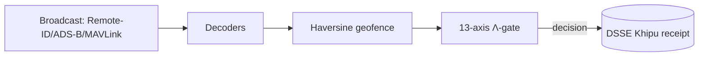
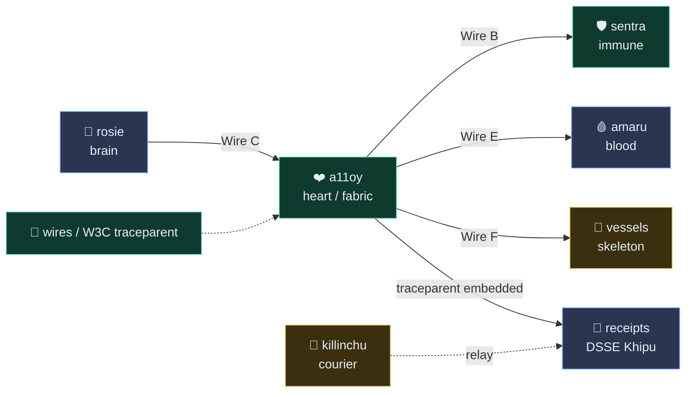

# killinchu 🦅
> Andean drone intelligence — a formally-governed counter-UAS rule engine with Λ-gate governance, DSSE Khipu receipts, and real Remote-ID / ADS-B / MAVLink ingest.

     

**749 declarations · 14 axioms · 163 sorries · Doctrine v11 LOCKED · kernel `c7c0ba17`**

[Quickstart](#quickstart) · [Docs](https://docs.szlholdings.com/flagships/killinchu) · [Cookbook](https://github.com/szl-holdings/szl-cookbook) · [Verify](#verify-in-2-minutes) · [Cite](#citation) · [Releases](https://github.com/szl-holdings/killinchu/releases)

## Live
- **Space:** https://szlholdings-killinchu.hf.space
- **Docs:** https://docs.szlholdings.com/flagships/killinchu
- **Release:** [v1.0.0](https://github.com/szl-holdings/killinchu/releases/tag/v1.0.0)

## What it does
- **Real protocol decoders (no mocks)** — Remote ID (ASTM F3411-22a), ADS-B (Mode-S 1090ES via pyModeS), MAVLink v1/v2 (pymavlink).
- **Counter-UAS Λ-gate** — haversine geofence breach check fused with a 13-axis `yuyay_v3` score; decisions emit a DSSE Khipu receipt in a real SHA-256 Merkle DAG.
- **Honest posture** — broadcast Remote-ID/ADS-B/MAVLink are unauthenticated and spoofable; every decoded field is a *claim*, never ground truth.

## Quickstart

```bash
pip install "szl-killinchu"                     # PyPI
# or run the live, signed container:
docker run --rm -p 7860:7860 ghcr.io/szl-holdings/killinchu:uds-v0.2.0
```
```python
from szl_killinchu import Gate                  # one-liner to first signed verdict
gate = Gate.from_doctrine("v11")             # loads the LOCKED 749/14/163 posture
verdict = gate.evaluate(receipt)             # -> signed verdict + receipt id
```

> Prefer zero-install? Hit the **[live Space](https://szlholdings-killinchu.hf.space)** or run the [Verify](#verify-in-2-minutes) block below — no credentials required.

## Verify (in 2 minutes)

```bash
# 1. Confirm the live doctrine posture on the running Space.
#    (Live-verified: this field is present in /v1/honest for killinchu.)
curl -s https://szlholdings-killinchu.hf.space/api/killinchu/v1/honest | jq .kernel_commit
# => "c7c0ba17"

# 2. Verify the signed UDS container artifact (cosign keyless OIDC).
#    Match the tag to the latest release asset; signing is keyless via the
#    GitHub Actions OIDC issuer.
cosign verify ghcr.io/szl-holdings/killinchu:uds-v0.2.0 \
  --certificate-identity-regexp="^https://github.com/szl-holdings/" \
  --certificate-oidc-issuer="https://token.actions.githubusercontent.com"

# 3. Inspect the public transparency-log entry for this image (Sigstore Rekor).
#    Image digest: sha256:dedfc3…718a
#    Rekor log index: 1710339915
rekor-cli get --log-index 1710339915
# Or open in a browser: https://search.sigstore.dev/?logIndex=1710339915
```

> Honest note: DSSE/Sigstore CI signing is being wired (receipt signatures are
> labelled `PLACEHOLDER` until CI signing lands). The `/v1/honest` check above is
> the authoritative live doctrine probe.

**Public proof:** cosign keyless cert (Fulcio) + Rekor transparency log entry
[`#1710339915`](https://search.sigstore.dev/?logIndex=1710339915) for image `ghcr.io/szl-holdings/killinchu:uds-v0.2.0` (`sha256:dedfc3…718a`).

## Try the cookbook

New here? The **[SZL Cookbook](https://github.com/szl-holdings/szl-cookbook)** has runnable recipes for your use case:

- **[Recipe 04 — Drone counter-UAS verdict](https://github.com/szl-holdings/szl-cookbook/blob/main/recipes/04-drone-counter-uas-verdict.md)**
- **[Recipe 11 — Kitaev surface drift detection](https://github.com/szl-holdings/szl-cookbook/blob/main/recipes/11-kitaev-surface-drift-detection.md)**
- **[Recipe 14 — Replicate the Walrus α-gap measurement](https://github.com/szl-holdings/szl-cookbook/blob/main/recipes/14-replicate-walrus-alpha-gap.md)**

Full index: [szl-cookbook/recipes](https://github.com/szl-holdings/szl-cookbook/tree/main/recipes).

## Architecture



## API surface

| Endpoint | Method | Description |
|---|---|---|
| `/api/killinchu/healthz` | GET | Liveness |
| `/api/killinchu/readyz` | GET | Readiness (DB + decoders loaded) |
| `/api/killinchu/v1/honest` | GET | Doctrine v11 honesty disclosure |
| `/api/killinchu/v1/version` | GET | Build + version metadata |
| `/api/killinchu/v1/remote-id/decode` | POST | Decode OpenDroneID / ASTM F3411 hex |
| `/api/killinchu/v1/counter-uas/evaluate` | POST | Geofence + 13-axis Λ-gate + receipt |
| `/api/killinchu/v1/lambda` | GET | Λ-gate axis definitions |

The full, canonical endpoint list is on the [docs site](https://docs.szlholdings.com/flagships/killinchu) and the [API reference](https://docs.szlholdings.com/api/).

## Doctrine
- **Doctrine v11 LOCKED** — 749/14/163 · kernel `c7c0ba17` (never bumped)
- **Λ = Conjecture 1** (NOT a theorem) — depends on the open CAUCHY_ND sorry + a missing symmetry axiom
- **SLSA L1 + L2 build provenance attested** · **Section 889 = exactly 5 vendors** (Huawei, ZTE, Hytera, Hikvision, Dahua)
- No Iron Bank / FedRAMP / CMMC / SWFT / Mission Owner claims

## License + DOI

- **License:** Apache-2.0 (OSS across all SZL Holdings repos).
- **Concept DOI:** [`10.5281/zenodo.20434276`](https://doi.org/10.5281/zenodo.20434276) — cite the archived release on Zenodo.

## Built with / learned from

This repository's structure and documentation conventions were learned from open-source
publication leaders — we adapted their *patterns*, not their words. Inspired by patterns from
**Polymathic AI** ([the_well](https://github.com/PolymathicAI/the_well), [walrus](https://github.com/PolymathicAI/walrus)),
**Anthropic**, **OpenAI** ([whisper](https://github.com/openai/whisper)), **Stripe** (docs craft),
Google DeepMind ([alphafold3](https://github.com/google-deepmind/alphafold3)),
Meta FAIR ([segment-anything](https://github.com/facebookresearch/segment-anything)),
EleutherAI ([lm-evaluation-harness](https://github.com/EleutherAI/lm-evaluation-harness)),
and Hugging Face ([transformers](https://github.com/huggingface/transformers)).
We are a precision substrate, not a vibes company.

## Citation

```bibtex
@software{szl_killinchu_2026,
  author    = {Lutar, Stephen P.},
  title     = {killinchu: Andean drone intelligence},
  year      = {2026},
  publisher = {SZL Holdings},
  version   = {v1.0.0},
  url       = {https://github.com/szl-holdings/killinchu},
  doi       = {10.5281/zenodo.20434276},
  note      = {Doctrine v11 LOCKED 749/14/163, kernel c7c0ba17}
}
```

## SLSA L2 build provenance (verify)

Every `ghcr.io/szl-holdings/killinchu` image ships a signed in-toto **SLSA provenance v1**
attestation (`actions/attest-build-provenance@v2`). killinchu is a private repository, so its
attestation is anchored in GitHub's attestation trust domain (verify with GitHub's tooling):

```bash
gh attestation verify oci://ghcr.io/szl-holdings/killinchu:uds-v0.2.0 --owner szl-holdings
```

SLSA L2 = hosted build platform (GitHub Actions) + signed provenance available to consumers.
L3 is **not** claimed (requires a hardened, isolated build environment).

---
*Doctrine v11 LOCKED · 749/14/163 · kernel c7c0ba17 · Λ = Conjecture 1 · SLSA L1 + L2 build provenance attested (verifiable via slsa-verifier)*

---

## 🔌 UDS Mesh — the nervous system

This organ is part of the **SZL UDS mesh**: a 7-organ trace + receipt substrate
(brain `rosie` · heart `a11oy` · blood `amaru` · immune `sentra` · nervous/courier
`killinchu` · skeleton `vessels` · wires = W3C `traceparent`).



**Honest mesh status (verified 2026-06-03):** every organ emits **real W3C trace
context** (`traceparent` / `tracestate` / `x-szl-wire-d: LIVE`) and a11oy binds it into
**DSSE Khipu receipts** — this is **LIVE in-process**. Spans are **not** yet OTLP-exported,
DSSE receipts are currently **unsigned**, and cross-pod organ routing is **roadmap (v0.4.0)**.
Honesty over checklist.

→ Full diagram + wire-status table: **[docs-site / mesh](https://szl-holdings.github.io/docs-site/mesh)**

<sub>Λ Conjecture 1 (not a theorem) · 749/14/163 v11 LOCKED · SLSA L1 honest · Section 889 = 5 vendors</sub>

---

## Real Edge Verdict Layer — `src/killinchu/` (added 2026-06-03, NO MOCKS)

A real, dependency-light edge inference layer ships under `src/killinchu/`:

| Module | What it does (REAL) |
|---|---|
| `lambda_calc.py` | Weighted **geometric-mean Λ** over 13 trust axes + a genuine **McAllester/Maurer PAC-Bayes** certified-floor (binary-KL inversion by bisection). Λ uniqueness remains **Conjecture 1**, never claimed as a theorem. |
| `dsse.py` | **Real ECDSA-P256-SHA256 over the DSSEv1 PAE** — verifiable by `cosign verify-blob` and by `verify_envelope()`. Key order: `SZL_COSIGN_PRIVATE_PEM` → `KILLINCHU_EDGE_KEY_PEM` → a **real ephemeral** key (honestly labelled `ephemeral`, never a placeholder). |
| `khipu.py` | **Real sha256 hash-chained** append-only Khipu DAG; optional JSONL persistence via `KILLINCHU_KHIPU_PATH`. |
| `edge.py` | `EdgeNode` consumes **real OTLP telemetry** (no random draws), maps fields → 13 axes deterministically, and emits a **signed Λ verdict + Khipu node**. |

**Live endpoints** (additive, registered before the SPA catch-all):

- `POST /api/killinchu/v1/verdict` — submit a real telemetry frame (OTLP attribute map or flat fields) → signed Λ verdict + Khipu receipt.
- `GET|POST /api/killinchu/v1/edge/3d` — 3-D scene where every POSTed track carries a real signed Λ verdict (no body ⇒ empty scene; we never fabricate tracks).

**Tested:** `tests/test_edge_real.py` (real OTLP fixture → Λ∈[0,1], DSSE verifies, geofence breach → DENY, Khipu chain intact, full ALLOW/REVIEW/DENY spectrum reachable) and `tests/test_no_mock.py` (static guard that **fails the build** if `mock`/`fake`/`stub`/`placeholder` leak into non-test source, plus runtime proof the signer is real ECDSA and Λ is computed). **15/15 green locally.**

**Honesty:** the **edge** DSSE signatures are real and verifiable. They are produced by an edge-local / ephemeral key by default — this is **not** the org-root Sigstore CI key, which is wired separately at the GHCR/bundle layer (where images carry real SLSA Provenance v1 + cosign-keyless attestation). ADS-B / Remote-ID fields remain **unauthenticated broadcast CLAIMS**, not attested truth. A single broadcast frame (n=1) is honestly **uncertain** and will not ALLOW; ALLOW requires a real fused dwell window.

<sub>Λ Conjecture 1 (not a theorem) · 749/14/163 v11 LOCKED · SLSA L1 honest + L2 attested (bundle/GHCR layer) · edge DSSE = real ECDSA-P256 · kernel c7c0ba17</sub>
