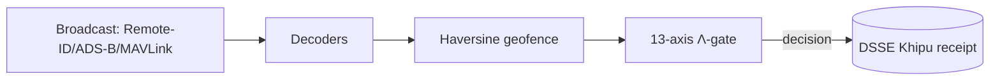

# killinchu 🦅
> Andean drone intelligence — a formally-governed counter-UAS rule engine with Λ-gate governance, DSSE Khipu receipts, and real Remote-ID / ADS-B / MAVLink ingest.

     

## Live
- **Space:** https://szlholdings-killinchu.hf.space
- **Docs:** https://docs.szlholdings.com/flagships/killinchu
- **Release:** [v1.0.0](https://github.com/szl-holdings/killinchu/releases/tag/v1.0.0)

## What it does
- **Real protocol decoders (no mocks)** — Remote ID (ASTM F3411-22a), ADS-B (Mode-S 1090ES via pyModeS), MAVLink v1/v2 (pymavlink).
- **Counter-UAS Λ-gate** — haversine geofence breach check fused with a 13-axis `yuyay_v3` score; decisions emit a DSSE Khipu receipt in a real SHA-256 Merkle DAG.
- **Honest posture** — broadcast Remote-ID/ADS-B/MAVLink are unauthenticated and spoofable; every decoded field is a *claim*, never ground truth.

## Verify (in 2 minutes)

```bash
# 1. Confirm the live doctrine posture on the running Space.
#    (Live-verified: this field is present in /v1/honest for killinchu.)
curl -s https://szlholdings-killinchu.hf.space/api/killinchu/v1/honest | jq .kernel_commit
# => "c7c0ba17"

# 2. Verify the signed UDS container artifact (cosign keyless OIDC).
#    Match the tag to the latest release asset; signing is keyless via the
#    GitHub Actions OIDC issuer.
cosign verify ghcr.io/szl-holdings/killinchu:uds-v0.2.0 \
  --certificate-identity-regexp="^https://github.com/szl-holdings/" \
  --certificate-oidc-issuer="https://token.actions.githubusercontent.com"
```

> Honest note: DSSE/Sigstore CI signing is being wired (receipt signatures are
> labelled `PLACEHOLDER` until CI signing lands). The `/v1/honest` check above is
> the authoritative live doctrine probe.

## Architecture



## API surface

| Endpoint | Method | Description |
|---|---|---|
| `/api/killinchu/healthz` | GET | Liveness |
| `/api/killinchu/readyz` | GET | Readiness (DB + decoders loaded) |
| `/api/killinchu/v1/honest` | GET | Doctrine v11 honesty disclosure |
| `/api/killinchu/v1/version` | GET | Build + version metadata |
| `/api/killinchu/v1/remote-id/decode` | POST | Decode OpenDroneID / ASTM F3411 hex |
| `/api/killinchu/v1/counter-uas/evaluate` | POST | Geofence + 13-axis Λ-gate + receipt |
| `/api/killinchu/v1/lambda` | GET | Λ-gate axis definitions |

The full, canonical endpoint list is on the [docs site](https://docs.szlholdings.com/flagships/killinchu) and the [API reference](https://docs.szlholdings.com/api/).

## Doctrine
- **Doctrine v11 LOCKED** — 749/14/163 · kernel `c7c0ba17` (never bumped)
- **Λ = Conjecture 1** (NOT a theorem) — depends on the open CAUCHY_ND sorry + a missing symmetry axiom
- **SLSA L1 honest** · **Section 889 = exactly 5 vendors** (Huawei, ZTE, Hytera, Hikvision, Dahua)
- No Iron Bank / FedRAMP / CMMC / SWFT / Mission Owner claims

## Citation

```bibtex
@software{szl_killinchu_2026,
  author    = {Lutar, Stephen P.},
  title     = {killinchu: Andean drone intelligence},
  year      = {2026},
  publisher = {SZL Holdings},
  version   = {v1.0.0},
  url       = {https://github.com/szl-holdings/killinchu},
  doi       = {10.5281/zenodo.20434276},
  note      = {Doctrine v11 LOCKED 749/14/163, kernel c7c0ba17}
}
```

---
*Doctrine v11 LOCKED · 749/14/163 · kernel c7c0ba17 · Λ = Conjecture 1 · SLSA L1 honest*
