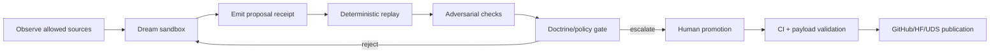

# Autonomous learning doctrine

A11oy can support autonomous exploration only as a governed, receipt-backed
proposal system. It may **dream**, **evaluate**, and **propose**. It may not
self-approve, self-promote, deploy, publish, or mutate canonical doctrine
without named human promotion and CI-backed evidence.

This keeps the user's “learn on its own and dream” goal real while preserving
the public doctrine: no hallucinated claims, no hidden state mutation, and no
marketing language that outruns evidence.

## Definitions

| Term | Doctrine-safe meaning |
| --- | --- |
| Dream | A sandboxed hypothesis, design, patch, benchmark route, or theorem/runtime mapping generated from allowed inputs. |
| Learning | A deterministic update to proposal priors, scores, maps, or staged artifacts. Model-weight training requires separate training receipts and is not implied here. |
| Evaluation | Deterministic replay plus adversarial checks against a frozen input root and policy hash. |
| Promotion | Human-approved movement from proposal/staged state into GitHub, release payload, UDS handoff, or Hugging Face mirror. |
| Publication | CI/release/HF/UDS exposure from tracked source after promotion. |

## Non-negotiable rules

1. **Proposal-only autonomy.** Autonomous loops emit proposals and evaluation
   receipts. They never directly mutate production state.
2. **No self-approval.** The proposing actor, evaluator actor, and approving
   human reviewer must be distinct. An agent cannot fill human approval fields.
3. **Receipts before claims.** A learning output without a valid receipt chain,
   payload hash, source commit, policy metadata, and replay result remains
   invisible outside sandbox review.
4. **Replay before promotion.** Learning/dream outputs must replay
   deterministically under pinned seeds, frozen inputs, and a policy hash before
   human review.
5. **No hallucinated public claims.** Every promoted claim must resolve to a
   source URI, commit, DOI, CI run, manifest, receipt, release, or explicit
   `roadmap`/`staged` label.
6. **No private-source ingestion.** Autonomous discovery may use public,
   licensed, permissioned, or user-provided sources only. Credentials, trade
   secrets, private repositories, and unlicensed datasets are forbidden inputs.
7. **No policy bypass.** Policy gates may reject or escalate; they cannot
   silently approve their own bypass.
8. **HF is mirror-only.** Hugging Face can expose generated receipts, maps, and
   diligence packets; GitHub remains canonical.
9. **UDS is proof-point until evidence changes.** Do not claim catalog
   acceptance, Defense Unicorns endorsement, or universal UDS deployability
   without separate public proof.

## Lifecycle



### 1. Source ingress

Record the source URI, license/permission class, retrieval timestamp, content
hash, actor ID, and claim status. Reject private or unlicensed data at ingress.

### 2. Dream sandbox

Generate a bounded proposal: doc, JSON map, patch, theorem/runtime hook,
benchmark route, or UDS/HF publication change. The proposal must include
intended files, expected behavior, risk class, and forbidden-claim scan output.

### 3. Proposal receipt

Emit an `AUTONOMOUS_LEARNING_PROPOSAL` receipt before external exposure. The
receipt must bind source commit, policy hash, payload hash, actor, tool
versions, and previous receipt hash.

### 4. Replay evaluation

Run deterministic replay with pinned seeds, frozen time/context, input roots,
tool versions, and output roots. A proposal should pass at least five replay
runs before human promotion is allowed.

### 5. Adversarial review

Exercise duplicate receipt IDs, sequence skips, timestamp regression, broken
previous hashes, weak quorum labels, policy-hash drift, unsupported-claim
language, and payload tampering.

### 6. Human promotion

Promotion requires a named human reviewer, approval basis, CI links, manifest
hashes, rollback ref, and published-surface list. Human approval is a separate
receipt from the autonomous proposal/evaluation chain.

### 7. Publication

Publication occurs only through GitHub-tracked source, workflows, release
payloads, generated Hugging Face mirrors, and UDS/operator handoff artifacts.

## Receipt requirements

Every autonomous-learning receipt must include:

| Field | Purpose |
| --- | --- |
| `schema_version` | Evolvable receipt schema contract. |
| `event_type` | `AUTONOMOUS_LEARNING_PROPOSAL`, `AUTONOMOUS_LEARNING_EVALUATION`, or `HUMAN_PROMOTION`. |
| `proposal_id` / `run_id` | Binds all receipts in a learning run. |
| `actor_id` | Agent/tool actor that produced the event. |
| `human_reviewer_id` | Required only for promotion receipts. |
| `source_commit` | Git commit that produced the proposal. |
| `harness_commit_sha` | Evaluation harness commit. |
| `tool_versions` | Model/tool/runtime versions used. |
| `policy` / `policy_hash` | Policy axes and exact policy root. |
| `lambda_axes` | Doctrine axes touched by the proposal. |
| `payload_hash` | Hash of proposal payload bytes. |
| `prev_receipt_hash` / `sequence` | Anti-replay and append-only chain structure. |
| `timestamp_iso8601` | Wall-clock trace. |
| `quorum_signatures` | Local quorum labels; not external cryptographic signer verification unless separately proven. |
| `qec_witness` | QEC/runtime integrity witness when available. |
| `merkle_root` | Output root for replay/audit. |
| `forbidden_claim_scan` | Evidence that public language was checked. |
| `staged_advisory` | Whether the proposal is staged, roadmap, verified runtime, or release payload. |

Evaluation receipts additionally include `replay_seeds`, `frozen_time`,
`input_roots`, `output_roots`, `deterministic_pass`, `variance_bounds`, and
`failure_receipts`.

Promotion receipts additionally include `approved_by`, `approval_time`,
`approval_basis`, `ci_runs`, `manifest_sha256`, `bundle_sha256`,
`rollback_ref`, and `published_surfaces`.

## Anti-replay requirements

Reject promotion if any of the following are observed:

- duplicate receipt IDs;
- non-monotonic or skipped sequence numbers;
- timestamp regression;
- mismatched previous hash;
- recomputed receipt ID mismatch;
- policy hash changed without a new evaluation;
- source commit changed without a new evaluation;
- weak or impossible quorum labels;
- payload hash mismatch;
- promotion receipt without proposal and evaluation ancestors.

## Claim-status gate

Learning proposals may produce only these public statuses:

| Status | Promotion rule |
| --- | --- |
| `verified-runtime` | Runtime hook, tests, and validation command exist and pass. |
| `release-payload` | Artifact appears in a checksummed payload/release path. |
| `lean-backed-current-green` | Exact Lean module has current green proof evidence. |
| `lean-backed-needs-upstream-ci` | Formal substrate exists but upstream proof CI is not current green. |
| `thesis-anchor` | DOI-pinned thesis language only. |
| `historical` | Lineage/context only. |
| `roadmap` | Not shipped; no active-demo claim. |

## Forbidden claims

Do not publish or promote these phrases without exact supporting evidence:

- “self-approved”
- “fully autonomous production learning”
- “trained/fine-tuned model”
- “all Lean green”
- “zero sorry”
- “Defense Unicorns endorsed”
- “UDS catalog accepted”
- “HF is canonical”
- “deploys everywhere”
- “guaranteed safe”
- “cannot hallucinate”
- “uses private/trade-secret data”
- “solved the benchmark”

## HF and UDS exposure

Hugging Face may include this doctrine, anatomy/runtime maps, benchmark maps,
sample receipts, and replay outputs as a generated diligence mirror. It must
not imply that A11oy is a hosted model checkpoint or that HF is canonical.

UDS surfaces may expose operator handoff materials, manifests, and proof-point
flows. Catalog-grade claims require signed assets, UDS package CRs, external
verification, and public release evidence.

## Runtime helper scope

`packages/policy/src/contracts/autonomous_learning.ts` provides receipt helpers
for `AUTONOMOUS_LEARNING_PROPOSAL`, `AUTONOMOUS_LEARNING_EVALUATION`, and
`HUMAN_PROMOTION` events. These helpers make the proposal/evaluation/promotion
boundary runtime-verifiable with the existing receipt substrate.

What this helper layer proves:

- proposal, evaluation, and promotion receipts can be emitted and verified;
- passing evaluations require at least five replay seeds;
- evaluation actors must differ from proposal actors;
- human promotion actors must differ from proposal and evaluation actors;
- chain verification catches missing ancestors and policy/source drift.

What this helper layer does **not** prove:

- external human identity beyond the local receipt fields;
- autonomous production deployment;
- self-approval;
- model-weight training;
- UDS catalog acceptance;
- Hugging Face canonical truth.

## Minimum validation lane

```bash
pnpm anatomy:runtime:audit
pnpm benchmark:audit
npm run test:autonomy-contracts
npm test --prefix packages/receipt-substrate
npm run test:policy-gates
pnpm payload:huggingface
```

Autonomous learning remains **operator-gated**: receipt helpers are
runtime-available, but a fully autonomous harness may only publish or deploy
after deterministic replay, CI-backed evidence, and named human promotion.
