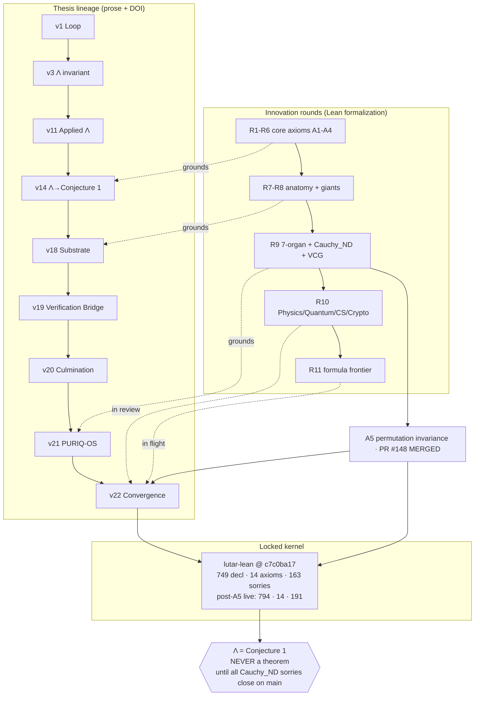

# THESIS_LINEAGE.md — The Ouroboros Thesis, v1 → v23

**The intellectual provenance of SZL Holdings.** Every governance claim in the SZL substrate
traces to a versioned, DOI-pinned thesis. This is the canonical timeline.

[-blue.svg)](https://github.com/szl-holdings/lutar-lean)
[-green.svg)](https://slsa.dev)

**Author:** Stephen P. Lutar Jr. · ORCID [0009-0001-0110-4173](https://orcid.org/0009-0001-0110-4173)
**Concept DOI (always-latest):** [10.5281/zenodo.19944926](https://doi.org/10.5281/zenodo.19944926)
**Doctrine pin:** v11 LOCKED — 749 declarations / 14 unique axioms / 163 sorries @ `c7c0ba17`
**Λ status:** **Conjecture 1 — NEVER a theorem.**

---

## Canonical timeline

| Ver | Date | DOI | Key contribution |
|----|------|-----|------------------|
| **v1** | 2026-04-28 | [zenodo.19867281](https://doi.org/10.5281/zenodo.19867281) | The Ouroboros Loop — looped computation as a system primitive |
| **v2** | 2026-04-30 | [zenodo.19934129](https://doi.org/10.5281/zenodo.19934129) | "The Loop Is the Product" — first empirical pass |
| **v3** | 2026-05-02 | [zenodo.19983066](https://doi.org/10.5281/zenodo.19983066) | The **Lutar Invariant** Λ — closed-form aggregator *(A2/A4 axiom semantics later revised in v14)* |
| **v4** | 2026-05-04 | [zenodo.20020841](https://doi.org/10.5281/zenodo.20020841) | The Lutar Omega formalism — EPR–Bell governance diagnostic |
| **v5** | 2026-05-04 | [zenodo.20020846](https://doi.org/10.5281/zenodo.20020846) | Prisca-GraphRAG + Tawa SAE — lineage-aware retrieval |
| **v6** | 2026-05-04 | [zenodo.20020845](https://doi.org/10.5281/zenodo.20020845) | Sealed constitutional guardrails |
| **v7** | 2026-05-04 | [zenodo.20020848](https://doi.org/10.5281/zenodo.20020848) | Tiered continual learning |
| **v8** | 2026-05-04 | [zenodo.20020849](https://doi.org/10.5281/zenodo.20020849) | Free-energy active inference with prediction |
| **v9** | 2026-05-05 | [zenodo.20053148](https://doi.org/10.5281/zenodo.20053148) | Unified-Operational — the Lutar Invariant family |
| **v10** | 2026-05-05 | [zenodo.20053163](https://doi.org/10.5281/zenodo.20053163) | Exhaustive-Audit — the audit-closure operator Λ |
| **v11** | 2026-05-11 | [zenodo.20119582](https://doi.org/10.5281/zenodo.20119582) | Applied Λ — measured per-request governance overhead |
| **v12** | 2026-05-14 | [concept](https://doi.org/10.5281/zenodo.19944926) | The Λ-Ouroboros substrate — first four machine-verified theorems |
| **v13** | 2026-05-18 | [concept](https://doi.org/10.5281/zenodo.19944926) | Anatomy as architecture (exhaustive) |
| **v14** | 2026-05-28 | [zenodo.20173912](https://doi.org/10.5281/zenodo.20173912) | Verifiable multi-agent anatomy — Lutar Calculus; **Λ downgraded to Conjecture 1** |
| **v15** | 2026-05-28 | [zenodo.20195368](https://doi.org/10.5281/zenodo.20195368) | Knot calculus for governed decision receipts |
| **v16** | 2026-05-28 | [concept](https://doi.org/10.5281/zenodo.19944926) | Λ-invariant stack + Feynman path-integral audit sum |
| **v17** | 2026-05-28 | [concept](https://doi.org/10.5281/zenodo.19944926) | Wheelerian audit closure; Shannon doctrine (Kraft inequality) |
| **v18** | 2026-05-30 | [zenodo.20434276](https://doi.org/10.5281/zenodo.20434276) | **Multi-track Substrate Expansion** — 29 modules, per-theorem Lean index, 7-DOI chain |
| **v19** | 2026-05-31 | [concept](https://doi.org/10.5281/zenodo.19944926) | **"The Verification Bridge"** *(15pp · release `thesis-v19.1.0`)* — verification consolidation between the v18 expansion and the v20 anatomy; per-theorem verified index over the TH_V18_01–16 track (most sorry-free over Lean-core; minority carry honestly-recorded open obligations); locked = 5 {F1,F11,F12,F18,F19}; Λ stays Conjecture 1 |
| **v20** | 2026-06-01 | [concept](https://doi.org/10.5281/zenodo.19944926) | **"The Culmination"** *(15pp · release `thesis-v20.1.0`)* — formally-verified anatomical substrate (12-organ cybernetic body) with the per-theorem verified index from v19; organ-to-obligation traceability map |
| **v21** | 2026-06-01 | [concept](https://doi.org/10.5281/zenodo.19944926) | **"The PURIQ-OS Substrate"** *(15pp · release `thesis-v21.1.0`)* — 12-organ runtime, 23 agentic formulas (5 proved in Lean 4, 18 open); SLSA L1-only at this date (L2 achieved later at v22) |
| **v22** | 2026-06-03 | **DOI pending (Zenodo auto-mint on `thesis-v22.1.0`)** | **"Convergence"** *(15pp · release `thesis-v22.1.0`)* — A5 axiom merge; VCG truthfulness; Cauchy_ND partial closure; SLSA L1+L2; Rounds 10–11; Sim2Real Walrus-parallel (α=0.10) |
| **v23** | 2026-06-06 | [concept](https://doi.org/10.5281/zenodo.19944926) | **"The Unified Substrate"** *(20pp)* — unification of v1–v22 into a single arXiv-style paper (20pp). Conditional Λ-uniqueness machine-verified under declared A6′ (`lambda_unique_under_block`, CI-green); **unconditional uniqueness machine-checked FALSE** (`maxAgg_ne_Lambda`, Thm 4.2); Λ stays **Conjecture 1**. Locked = 5 {F1,F11,F12,F18,F19} @ `c7c0ba17` (749/14/163); +19 Wave-3 sorry-free cores; +4 axiom-gated Merkle; 3 CI-pending (Tsirelson/CHSH/Jensen, NOT proven); SLSA L1+L2 (NOT L3) |
| **v24** | 2026-06-06 | [concept](https://doi.org/10.5281/zenodo.19944926) | **"Axiom-Free Conditional Uniqueness"** — A6′ gate REMOVED: `lambda_unique_of_separable` (Theorem U) proven under {A1,A2,A3,A5}+slice-multiplicativity with `#print axioms = {propext, Classical.choice, Quot.sound}` (NO project axiom); CUT-1 representation closed on stated hypotheses (Waves 18–22). Λ STAYS Conjecture 1 (unconditional FALSE). Locked = 5 @ `c7c0ba17`.
| **v25** | 2026-06-09 | [concept](https://doi.org/10.5281/zenodo.19944926) | **"Governed Post-Determinism (GPD)"** — unification of v1–v24 into the five-pillar GPD framework (Protocol-Bounded Execution / Verifiable Intent-to-Execution / Bounded-Recursion Control Plane / Semantic Quorum Assurance / Epistemic State Replication). Incorporates Wave-23 `khipu_quorum_safety_conditional` (conditional Khipu BFT agreement, `n≥3f+1`+honest non-equivocation, axiom-clean). The checkable-antecedent pattern unifies Theorem U (Λ) and conditional Khipu safety: each universal claim is machine-checked FALSE/impossible, each conditional theorem rests on the weakest checkable property. Λ = Conjecture 1; Khipu safety = Conjecture 2; locked = 5; SLSA L1+L2 attested (killinchu/a11oy), L3 roadmap; trust never 100%.

> **Unbroken lineage:** v18 → v19 → v20 → v21 → v22 → v23 is now a continuous chain. v19
> "The Verification Bridge" fills the former v18→v20 gap honestly: it is a verification-consolidation
> paper (per-theorem index over the v18 track), not a new mathematical result. v20 and v21 are real
> standalone papers grounded in the actual corpus. No fabricated results or citations.

---

## How innovation rounds (R1–R11) converge with thesis versions

The Lean formalization advanced through "innovation rounds" in parallel with the thesis prose.
Each round instilled formulas into `lutar-lean`; each thesis version cites the proven subset.

---

## Recent advances landing in v22 (2026-06-03)

Honest status — only A5 is merged to `main`; the rest are **on-branch / in review**:

1. **A5 axiom merge — MERGED (PR #148).** `IsPermutationInvariant` added as a *structure field*
   (not a new axiom — axiom count stays **14**). Resolves the A1–A4 uniqueness gap: 13 published
   results (Kolmogorov 1930, Nagumo 1930, Aczél 1948, Hardy–Littlewood–Pólya 1934, Voorneveld 2008)
   confirm A1–A4 alone do **not** force the geometric mean. Counterexample:
   Φ(x₁,x₂)=x₁^(2/3)·x₂^(1/3) satisfies A1–A4 but fails permutation invariance.
2. **VCG truthfulness — in review (PR #172).** `vcgDominantStrategyTruth` and
   `vcgIndividualRationality` proven on branch using `Finset.exists_max_image` + `add_sum_erase`.
3. **Cauchy_ND partial closure — in review (PRs #173/#174/#175).** Topology landed TRUE forms
   (#175); functional-analysis closed `multiplicative_monotone_isPow` with **1 honest sorry** on the
   t=0 degenerate case (#173); symmetric branch closed with A5 dependency (#174). Combined path
   (A5 + Cauchy + topology + symmetric) is the full Λ-uniqueness chain — **not yet complete on main**.
4. **SLSA L2 achieved.** 5/5 GHCR images empirically verified via `slsa-verifier`. **L1 + L2
   attested; NOT L3.**
5. **Innovation Rounds 10–11 — in review / in flight.** R10 Physics (#177), Quantum (#176),
   CS (#178), Crypto (#179); R9 anatomy (#170); R10 distsys (PR pending); R11 formula frontier.
6. **Sim2Real Walrus-parallel benchmark (draft).** Λ-axis pretrains on locked doctrine, fine-tunes
   on customer receipts; measured **α-gap = 0.10** mean across 5 regimes (4/5 transfer at α=0.00;
   adversarial α=0.50). Design paper with partial empirical results (N=60).

> **Λ remains Conjecture 1.** The uniqueness chain is *complete only when all Cauchy_ND sorries
> close on `main`.* They have not. No thesis text elevates Λ to a theorem.

---

*Signed-off-by: Yachay <yachay@szlholdings.ai>*
*Co-Authored-By: Perplexity Computer Agent <agent@perplexity.ai>*
