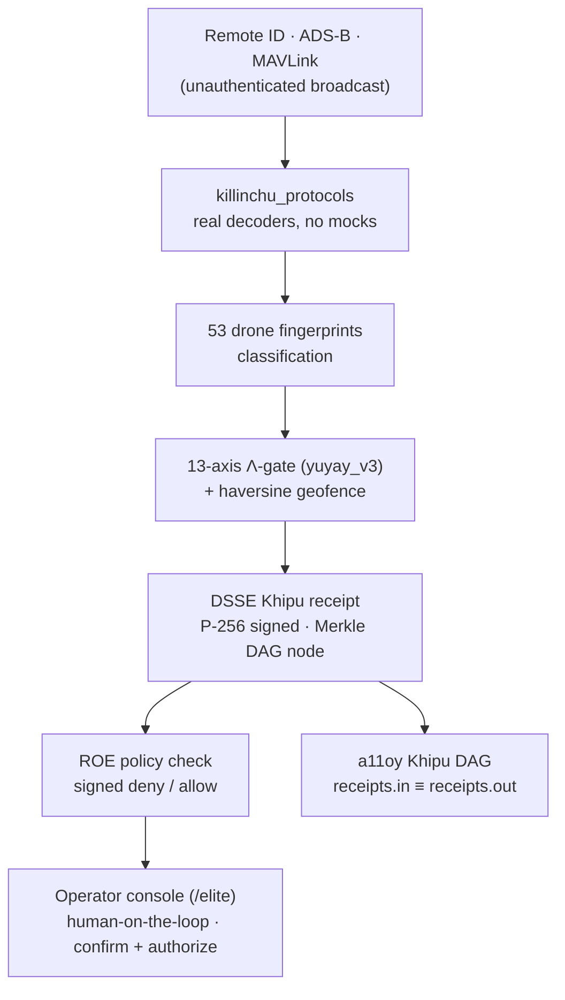

<!--
SPDX-License-Identifier: Apache-2.0
© Stephen P. Lutar Jr. (ORCID 0009-0001-0110-4173) · Doctrine v11 LOCKED
-->

# killinchu Architecture — the governed counter-UAS edge organ

> Companion to the [README](../README.md) and [DEVELOPER_ONBOARDING.md](../DEVELOPER_ONBOARDING.md).
> This document is the deeper read for an engineer, defense buyer, or judge who wants
> the repo layout, the entry point, how surfaces register, the shared modules, and the
> honest capability map — enough to understand the codebase in five minutes.
>
> **Doctrine v11 LOCKED · 749/14/163 · Λ = Conjecture 1 · HONESTY OVER CHECKLIST.**

---

## 1. One line

killinchu is a **counter-UAS edge organ**: it decodes real, unauthenticated drone
broadcasts (Remote ID / ADS-B / MAVLink), scores them through a **13-axis Λ-gate** with a
haversine geofence, and mints a **DSSE-signed Khipu receipt for every verdict** under
human authority. It governs and signs the *decision*; the operator owns the *engagement*.

---

## 2. Entry point + how a request flows

`serve.py` is the boot entry and route-assembly point. It builds the FastAPI app, mounts
the static SPA at `/`, and wires the REAL `/api/killinchu/v1/*` endpoints (protocol
decoders, the counter-UAS evaluate path, the Khipu receipt ledger). It then registers the
showcase surfaces (see §3) and finally falls back to the SPA history route (`/{path} ->
index.html`).

The canonical decision endpoint is `POST /api/killinchu/v1/counter-uas/evaluate`, which
fuses three things into one signed verdict:

1. **Haversine geofence** — distance from the protected boundary, in metres.
2. **13-axis Λ score** — `yuyay_v3` geometric-mean aggregate over 13 trust axes. Λ is an
   **advisory** score (Conjecture 1, never a theorem); it can only *tighten*, never
   override, a hard DENY.
3. **DSSE Khipu receipt** — every ALLOW/HALT verdict mints an ECDSA-P256-SHA256 DSSE
   receipt on a SHA-256 hash-linked Merkle DAG. Real signature when
   `SZL_COSIGN_PRIVATE_PEM` is present; an honest, clearly-labelled PLACEHOLDER when
   absent — never faked.



---

## 3. How surfaces register (the `register()` pattern)

killinchu is **flat-rooted**: most modules live beside `serve.py`. A user-visible surface
is a self-contained module that exposes a top-level `register(app, ns="killinchu")`
function. `serve.py` imports the module (try/except-guarded so a missing optional module
degrades honestly rather than crashing the Space) and calls:

```python
_szl_<name>.register(app, ns="killinchu")   # adds routes; returns an honest status dict
```

**Ordering is load-bearing.** Every `register()` call must run **before** the SPA
catch-all route (`/{path} -> index.html`) is installed. FastAPI matches routes in
declaration order, so a surface registered after the catch-all would be shadowed by the
SPA and 404 client-side. Nav-injection modules (e.g. `killinchu_nav_wireup.py`) insert
their middleware/redirects at index `0` for the same reason — they must resolve before the
SPA/proxy fallback. There are ~90 such `register(...)` calls in `serve.py` today.

The showcase front door is `killinchu_elite_console.py`, served at **`/elite`** (alias
`/killinchu/elite`) — a single self-contained HTML+JS console with 44 left-nav views plus
maritime/drone live demos and a 3D health twin. Each tab calls a REAL, already-registered
endpoint and renders live JSON; an empty buffer renders an honest IDLE state, never an
invented row.

---

## 4. Repo map (where things live)

The flat repo groups *logically* like this. Modules listed already exist and run live.

| Layer | Role | Representative modules |
|---|---|---|
| **entry** | boot + route assembly + SPA mount | `serve.py` |
| **showcase console** | the `/elite` operator console + view pages | `killinchu_elite_console`, `killinchu_elite_wiring`, `*_view` pages, `killinchu_nav_wireup` |
| **decoders** | real protocol parsers (no mocks) | `killinchu_protocols`, `killinchu_kalman`, `killinchu_fusion`, `build_drone_db` |
| **counter-UAS logic** | geofence + 13-axis Λ-gate + ROE | `killinchu_drone_routes`, `killinchu_autonomy`, `killinchu_ops_control`, `szl_cuas_formulas` |
| **maritime / intel** | maritime risk, OSINT, globe surfaces | `killinchu_maritime_*`, `killinchu_osint`, `killinchu_mosaic`, `killinchu_naval_haps` |
| **provenance** | signed receipts (audit fiber) | `szl_dsse`, `szl_khipu_consensus`, `szl_khipu_lmdb`, `szl_provenance`, `szl_rekor`, `killinchu_szl_pqc_sign` |
| **governance** | doctrine gate + restraint / Λ + guards | `szl_qhawaq`, `szl_restraint`, `szl_codename_gate`, `szl_unay`, `szl_conjecture_factory` |
| **anatomy / organs** | shared SZL Agent Body engine | `killinchu_anatomy`, `killinchu_organism`, `szl_anatomy_routes`, `szl_brain` |
| **shared substrate** | byte-identical across a11oy + killinchu | `szl_*.py` (see §5) |

For the deeper synthesis (honest capability map, novelty boundary) the a11oy companion at
[a11oy `docs/architecture.md`](https://github.com/szl-holdings/a11oy/blob/main/docs/architecture.md)
documents the shared substrate in full.

---

## 5. Shared modules are byte-identical across a11oy + killinchu

Many `szl_*.py` (and a few `a11oy_*.py`) modules are vendored into **both** flagships and
are kept **byte-identical**. Examples: `szl_dsse.py`, `szl_be_hardening.py`,
`szl_formula_wiring.py`, `szl_formulas.py`, `a11oy_hf_assets.py`. This is enforced by CI,
not by convention:

- **`shared-file-drift` guard** — derives the shared set from both Dockerfiles' COPY lists,
  then fails the build if a file that is currently identical diverges in either repo. It is
  a ratchet: deliberate, documented divergences live in `.github/shared-file-drift-allow.txt`;
  everything else must stay identical.

**Rule for contributors:** if you edit a shared `szl_*.py` in one repo, apply the *identical*
edit in the sibling repo in the same change — including comment and docstring edits.

---

## 6. Doctrine hard-gates (what CI will not let you weaken)

| Gate | Workflow | What it enforces |
|---|---|---|
| Banned-token grep | `doctrine.yml` / org doctrine gate | no marketing-superlative tokens; no user-visible codenames; factual claims carry an adjacent citation |
| `locked = 8` | doctrine constants | exactly 8 locked-proven formulas `{F1,F4,F7,F11,F12,F18,F19,F22}` — never inflated |
| Λ = Conjecture 1 | doctrine / overclaim guard | Λ-uniqueness is a conjecture, never described as a theorem |
| gitleaks / secret health | `gitleaks.yml` | never commit a key or secret |
| Shared-source drift | `shared-file-drift.yml` | shared modules stay byte-identical across a11oy + killinchu |
| copy-sync lockstep | `copy-sync-lockstep-guard.yml` | every module `serve.py` imports is in the Dockerfile COPY set and the HF mirror set |
| DCO sign-off | `dco.yml` | every commit carries a `Signed-off-by` trailer matching the author |
| Honest-label discipline | overclaim / honesty guards | MEASURED / SAMPLE / MODELED / PLACEHOLDER / ROADMAP labels are accurate |

---

## 7. Honest posture (the credibility asset)

killinchu states its limits plainly:

- Remote-ID / ADS-B / MAVLink are **unauthenticated** broadcasts. Every decoded field is a
  *claim*, never ground truth; verdicts reflect governance logic over those claims, not
  cryptographic authenticity of the broadcast.
- Receipts are PLACEHOLDER unless `SZL_COSIGN_PRIVATE_PEM` is present — and they say so.
- SLSA **L1 honest · L2 build-attested**; L3 / FedRAMP / CMMC / Iron Bank / ATO are
  **ROADMAP**, never claimed achieved.
- Λ-uniqueness is **Conjecture 1**; Byzantine BFT safety is **Khipu Conjecture 2 (open)**.
- killinchu is a **precision substrate**, not a turnkey weapon system. Human-on-the-loop is
  required; defensive scope is locked in doctrine.

---

*Doctrine v11 LOCKED · honest labels: MEASURED / SAMPLE / MODELED / PLACEHOLDER / ROADMAP ·
no banned tokens · HONESTY OVER CHECKLIST. Sources: live `/api/killinchu/v1/honest`, the
repo's flat module set, `serve.py` route assembly, and the `killinchu_elite_console.py` /
`killinchu_nav_wireup.py` headers — not invented.*
